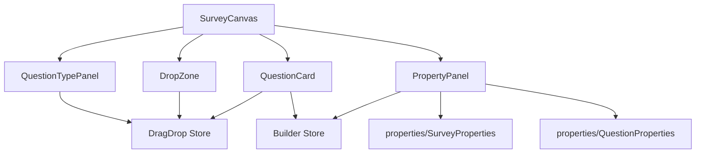

# Builder Components 目錄

> 📁 **目錄作用**：問卷建構器相關的所有 Vue 組件
>
> 📅 **最後更新**：2025-01-20
>
> 🎯 **負責功能**：提供問卷編輯、拖放、屬性設定等核心交互界面

## 📋 包含檔案清單

### 🎨 核心組件

| 檔案名稱                | 作用說明                               | 依賴關係        |
| ----------------------- | -------------------------------------- | --------------- |
| `SurveyCanvas.vue`      | 問卷畫布主組件，管理整體佈局和組件編排 | 使用所有子組件  |
| `QuestionCard.vue`      | 單個題目的卡片組件，提供編輯和拖放功能 | Builder Store   |
| `DropZone.vue`          | 拖放區域組件，處理題目插入邏輯         | DragDrop Store  |
| `QuestionTypePanel.vue` | 題型選擇面板，提供可拖拽的題型列表     | Questions Store |
| `PropertyPanel.vue`     | 屬性編輯面板，根據選擇顯示對應屬性     | 切換子組件      |

### 🔧 工具組件

| 檔案名稱      | 作用說明         | 使用場景                 |
| ------------- | ---------------- | ------------------------ |
| `previews/`   | 題目預覽組件目錄 | 顯示不同題型的預覽效果   |
| `properties/` | 屬性編輯組件目錄 | 編輯問卷和題目的詳細屬性 |

## 🔄 組件間交互邏輯

## 🎯 主要業務流程

1. **題型拖放流程**：
   - `QuestionTypePanel` 開始拖放題型
   - `DragDrop Store` 管理拖放狀態
   - `DropZone` 偵測放置位置
   - `Questions Store` 新增題目到問卷

2. **題目編輯流程**：
   - `QuestionCard` 選中題目
   - `Builder Store` 更新選中狀態
   - `PropertyPanel` 切換到題目屬性
   - `QuestionProperties` 提供編輯界面

3. **問卷屬性流程**：
   - 點擊空白區域取消選擇
   - `PropertyPanel` 切換到問卷屬性
   - `SurveyProperties` 提供問卷設定

## 🔗 Store 依賴關係

- **Builder Store**: 管理問卷狀態、選中項目
- **Questions Store**: 管理題目列表、CRUD 操作
- **DragDrop Store**: 管理拖放交互狀態

## 🚀 開發注意事項

1. **性能優化**：
   - 使用 `computed` 進行狀態計算
   - 避免不必要的重新渲染
   - 大列表考慮虛擬滾動

2. **用戶體驗**：
   - 提供拖放視覺反饋
   - 操作要有適當的動畫效果
   - 錯誤狀態要有明確提示

3. **數據一致性**：
   - 所有狀態變更必須通過 Store
   - 避免組件間直接傳遞複雜狀態
   - 使用 Pinia 的響應式特性

## 📝 更新規範

**新增組件時必須更新：**

1. 此 README 的檔案清單
2. 組件間交互圖
3. 相關的業務流程說明
4. Store 依賴關係（如有變更）

**最後更新者**：Claude AI Assistant **下次檢查**：下個主要功能完成時
