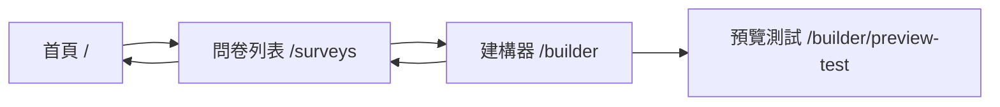

# Pages 頁面目錄

> 📁 **目錄作用**：Nuxt3 應用的路由頁面組件
>
> 📅 **最後更新**：2025-01-21
>
> 🎯 **負責功能**：定義應用的路由結構和頁面內容

## 📋 頁面結構

### 🏠 主要頁面

| 頁面路徑   | 檔案名稱      | 功能描述         | 狀態      |
| ---------- | ------------- | ---------------- | --------- |
| `/`        | `index.vue`   | 首頁，應用入口   | ✅ 已完成 |
| `/surveys` | `surveys.vue` | 問卷列表頁面     | ✅ 已完成 |
| `/builder` | `builder.vue` | 問卷建構器主頁面 | ✅ 已完成 |

### 🔬 測試頁面

| 頁面路徑                | 檔案名稱                   | 功能描述         | 狀態      |
| ----------------------- | -------------------------- | ---------------- | --------- |
| `/builder/preview-test` | `builder/preview-test.vue` | 預覽功能測試頁面 | ✅ 已完成 |

## 🎯 頁面功能說明

### index.vue - 首頁

- **功能**：應用的歡迎頁面和導航入口
- **特色**：展示平台特色、用戶導引
- **路由**：`/`

### surveys.vue - 問卷管理

- **功能**：問卷列表顯示與管理
- **特色**：支援搜尋、篩選、排序功能
- **路由**：`/surveys`
- **依賴**：Builder Store、認證中間件

### builder.vue - 問卷建構器

- **功能**：問卷編輯的主要工作區
- **特色**：拖拽編輯、即時預覽、屬性設定
- **路由**：`/builder`
- **核心組件**：
  - SurveyCanvas - 問卷畫布
  - QuestionTypePanel - 題型面板
  - PropertyPanel - 屬性面板
  - SurveyPreview - 預覽面板

### builder/preview-test.vue - 預覽測試

- **功能**：獨立的預覽功能測試環境
- **特色**：完整的問卷填寫和驗證體驗
- **路由**：`/builder/preview-test`
- **用途**：開發期間測試預覽功能的完整性

## 🔄 頁面間導航流程



## 🛡️ 路由保護

### 認證要求

- `/` - 無需認證
- `/surveys` - 需要登入
- `/builder` - 需要登入
- `/builder/preview-test` - 開發環境開放，生產環境需要登入

### 權限檢查

- 所有需要認證的頁面都會檢查用戶登入狀態
- 未登入用戶會自動重定向至登入頁面
- 使用 Nuxt3 的 middleware 系統進行路由保護

## 🎨 頁面佈局結構

### 通用佈局元素

- **Header**：頂部導航列，包含 logo 和用戶選單
- **Sidebar**：側邊欄（在需要的頁面）
- **Main Content**：主要內容區域
- **Footer**：頁尾資訊（在適當的頁面）

### 響應式設計

- **桌面版** (≥1024px)：完整側邊欄和工具面板
- **平板版** (768px-1023px)：摺疊式側邊欄
- **手機版** (<768px)：堆疊式佈局，隱藏非必要元素

## 🔧 開發指南

### 新增頁面時

1. 在 `pages/` 目錄下創建 `.vue` 檔案
2. 檔案名稱即為路由路徑
3. 使用 `definePageMeta()` 設定頁面元資料
4. 加入必要的認證中間件
5. 更新此 README 的頁面列表

### 頁面結構範例

```vue
<template>
  <div class="page-container">
    <PageHeader :title="pageTitle" />
    <main class="main-content">
      <!-- 頁面內容 -->
    </main>
  </div>
</template>

<script setup lang="ts">
// 頁面元資料
definePageMeta({
  title: '頁面標題',
  requiresAuth: true,
  layout: 'default',
});

// SEO 設定
useHead({
  title: '頁面標題 - SmartSurvey Pro',
  meta: [{ name: 'description', content: '頁面描述' }],
});
</script>
```

## 📝 最近更新

### 2025-01-21

- ✅ 完成問卷預覽功能實作
- ✅ 新增 `builder/preview-test.vue` 測試頁面
- ✅ 更新路由結構和文檔

### 下個階段計劃

- [ ] 新增公開問卷填寫頁面 (`/s/[surveyId]`)
- [ ] 實作問卷結果統計頁面 (`/surveys/[id]/analytics`)
- [ ] 新增用戶個人設定頁面 (`/settings`)

---

**最後更新者**：Claude AI Assistant **文檔版本**：v1.1
**下次檢查**：新增頁面時更新
