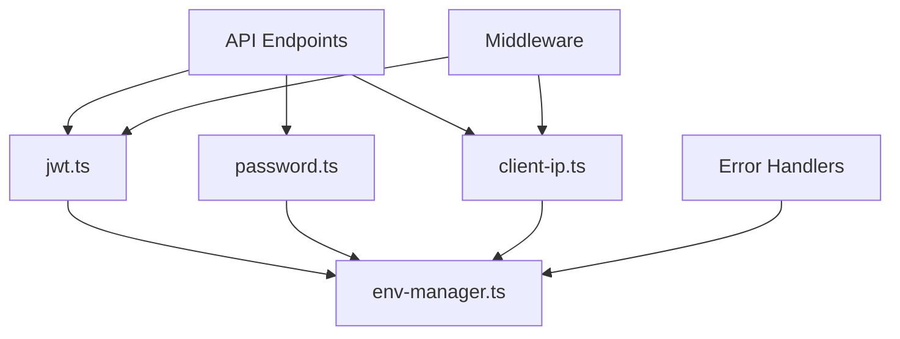

# Server Utils 伺服器工具函數目錄

> 📁 **目錄作用**：伺服器端共用的工具函數和輔助模組
>
> 📅 **最後更新**：2025-01-20
>
> 🎯 **負責功能**：提供認證、加密、環境管理等核心功能支援

## 📋 工具模組清單

| 檔案名稱         | 功能說明       | 依賴關係     | 使用場景     |
| ---------------- | -------------- | ------------ | ------------ |
| `jwt.ts`         | JWT Token 管理 | jsonwebtoken | 認證系統核心 |
| `password.ts`    | 密碼加密和驗證 | bcrypt       | 用戶認證     |
| `env-manager.ts` | 環境變數管理   | 無           | 配置管理     |
| `client-ip.ts`   | 客戶端 IP 取得 | 無           | 安全日誌     |

## 🔧 詳細模組說明

### 1. jwt.ts - JWT Token 管理

**核心功能**：JWT Token 的生成、驗證和管理

**主要函數**：

```typescript
// Token 生成
generateAccessToken(payload: JWTPayload): string
generateRefreshToken(payload: RefreshPayload): string
generateTokenPair(user: User): TokenPair

// Token 驗證
verifyAccessToken(token: string): JWTPayload | null
verifyRefreshToken(token: string): RefreshPayload | null
extractTokenFromHeader(event: H3Event): string | null

// Token 解析
decodeTokenPayload(token: string): any
```

**設計原則**：

- **短期 Access Token**：15-30 分鐘有效期
- **長期 Refresh Token**：7-30 天有效期
- **對稱加密**：使用 HS256 算法
- **錯誤處理**：安全的錯誤訊息，不洩漏內部資訊

**使用範例**：

```typescript
// 在認證 API 中使用
const tokens = generateTokenPair(user);
const payload = verifyAccessToken(accessToken);
```

### 2. password.ts - 密碼加密和驗證

**核心功能**：安全的密碼處理

**主要函數**：

```typescript
// 密碼加密
hashPassword(plainPassword: string): Promise<string>

// 密碼驗證
verifyPassword(plainPassword: string, hashedPassword: string): Promise<boolean>

// 密碼強度檢查（未來實作）
validatePasswordStrength(password: string): PasswordStrengthResult
```

**安全特性**：

- **bcrypt 加密**：業界標準的密碼哈希算法
- **Salt Rounds**：預設 10 輪，可通過環境變數調整
- **異步處理**：避免阻塞事件循環
- **常數時間比較**：防止時序攻擊

**配置管理**：

```typescript
const rounds = parseInt(process.env.BCRYPT_ROUNDS || '10', 10);
```

### 3. env-manager.ts - 環境變數管理

**核心功能**：統一的環境變數存取和管理

**主要函數**：

```typescript
// 基本取值
getEnv(key: string): string | undefined
getRequiredEnv(key: string): string
getEnvWithDefault<T>(key: string, defaultValue: T): T

// 類型轉換
getEnvAsNumber(key: string, defaultValue?: number): number
getEnvAsBoolean(key: string, defaultValue?: boolean): boolean
getEnvAsArray(key: string, separator?: string): string[]

// 機敏資料管理
getSecret(key: string): string
validateEnvironment(): void
```

**設計原則**：

- **型別安全**：自動轉換和驗證環境變數類型
- **錯誤處理**：缺少必要環境變數時拋出明確錯誤
- **預設值管理**：提供合理的預設值
- **機敏資料保護**：區分一般配置和機敏資料

**使用範例**：

```typescript
const jwtSecret = getSecret('JWT_SECRET');
const bcryptRounds = getEnvAsNumber('BCRYPT_ROUNDS', 10);
const allowedOrigins = getEnvAsArray('ALLOWED_ORIGINS', ',');
```

### 4. client-ip.ts - 客戶端 IP 取得

**核心功能**：安全可靠的客戶端 IP 地址提取

**主要函數**：

```typescript
// 基本 IP 取得
getClientIP(event: H3Event): string | null

// 真實 IP 取得（考慮 Proxy）
getRealClientIP(event: H3Event): string | null

// IP 驗證
isValidIP(ip: string): boolean
isPrivateIP(ip: string): boolean

// IP 地理位置（未來實作）
getIPGeolocation(ip: string): Promise<GeolocationResult>
```

**處理邏輯**：

```typescript
// IP 優先級順序
1. X-Forwarded-For (第一個 IP)
2. X-Real-IP
3. CF-Connecting-IP (Cloudflare)
4. X-Client-IP
5. connection.remoteAddress
```

**安全考量**：

- **Proxy 感知**：正確處理反向代理場景
- **偽造防護**：驗證 IP 地址格式
- **隱私保護**：可選的 IP 脫敏處理
- **日誌記錄**：用於安全審計和異常檢測

## 🔐 安全最佳實踐

### 機敏資料處理

```typescript
// 環境變數分級
- PUBLIC_*: 前端可見的配置
- API_*: 後端 API 配置
- SECRET_*: 機敏資料（JWT Secret, DB 密碼等）
```

### 錯誤處理

```typescript
// 安全的錯誤訊息
try {
  const payload = verifyAccessToken(token);
} catch (error) {
  // 不洩漏具體錯誤內容
  throw createError({
    statusCode: 401,
    statusMessage: 'Token 無效',
  });
}
```

### 日誌記錄

```typescript
// 記錄重要操作但不記錄機敏資料
logger.info('Password verification', {
  userId: user.id,
  success: isValid,
  // 不記錄實際密碼
});
```

## 🚀 效能考量

### 密碼處理優化

```typescript
// 使用適當的 bcrypt rounds
- 開發環境：8-10 rounds
- 生產環境：10-12 rounds
- 高安全需求：12-15 rounds
```

### JWT 優化

```typescript
// Token 大小控制
-最小必要載荷 - 避免敏感資料 - 使用簡短的欄位名稱;
```

### 快取策略

```typescript
// 環境變數快取（避免重複解析）
const envCache = new Map<string, any>();

// JWT 解碼快取（短期快取）
const jwtCache = new LRUCache({ max: 1000, ttl: 60000 });
```

## 🧪 測試策略

### 單元測試重點

```typescript
describe('JWT Utils', () => {
  test('Token 生成和驗證', () => {
    const token = generateAccessToken(payload);
    const decoded = verifyAccessToken(token);
    expect(decoded.userId).toBe(payload.userId);
  });

  test('過期 Token 處理', () => {
    const expiredToken = generateTokenWithCustomExpiry(-1);
    expect(verifyAccessToken(expiredToken)).toBeNull();
  });
});
```

### 安全測試重點

- [ ] JWT Secret 洩漏防護
- [ ] 密碼暴力破解防護
- [ ] IP 偽造攻擊防護
- [ ] 環境變數注入防護

## 📝 Phase 2 擴展功能

### 高級安全功能

```typescript
// 計劃新增的模組
- rate-limiter.ts: API 限流工具
- crypto.ts: 高級加密工具
- audit-logger.ts: 安全審計日誌
- session-manager.ts: 會話管理工具
```

### 效能監控

```typescript
// 性能監控工具
- performance-monitor.ts: 效能監控
- cache-manager.ts: 統一快取管理
- metrics-collector.ts: 指標收集
```

### 輔助工具

```typescript
// 開發輔助工具
- validator.ts: 統一驗證工具
- formatter.ts: 資料格式化工具
- error-handler.ts: 統一錯誤處理
```

## 🔄 模組間依賴關係



## 📋 開發規範

### 新增工具函數時

1. **統一介面**：遵循現有的函數命名規範
2. **錯誤處理**：提供適當的錯誤處理和訊息
3. **類型安全**：完整的 TypeScript 類型定義
4. **測試覆蓋**：編寫對應的單元測試
5. **文件更新**：更新此 README 說明

### 版本控制

- **向後相容**：確保 API 變更的向後相容性
- **廢棄警告**：舊函數廢棄前提供遷移指南
- **變更日誌**：記錄重要變更和影響

---

**最後更新者**：Claude AI Assistant **下次檢查**：新增工具模組時
