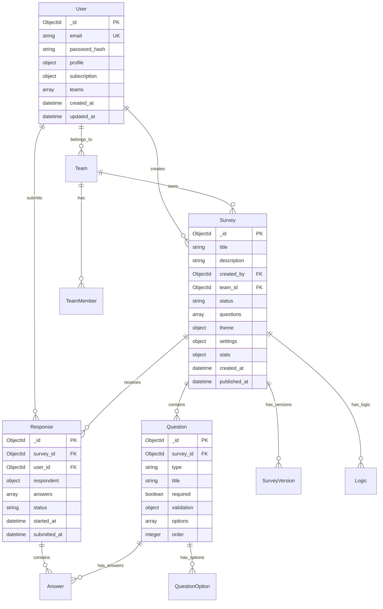

# SmartSurvey Pro - API 與資料模型設計文檔

> 📅 文件版本：v1.0  
> 📝 最後更新：2025-01-10  
> 🔧 API 規範：RESTful + OpenAPI 3.0  
> 🗄️ 資料庫：MongoDB Atlas + Redis Cloud

---

## 📊 資料模型總覽

### 核心實體關係圖



---

## 🗄️ MongoDB Schema 設計

### 1. Users Collection

```typescript
// users collection schema
interface User {
  _id: ObjectId;

  // 認證資訊
  auth: {
    email: string; // 唯一索引
    password: string; // bcrypt hash
    provider: 'local' | 'google' | 'github';
    provider_id?: string;
    email_verified: boolean;
    verification_token?: string;
    reset_token?: string;
    reset_token_expires?: Date;
    two_factor_enabled: boolean;
    two_factor_secret?: string;
  };

  // 個人資料
  profile: {
    first_name: string;
    last_name: string;
    display_name: string;
    avatar_url?: string;
    bio?: string;
    phone?: string;
    company?: string;
    position?: string;
    timezone: string; // 預設: 'Asia/Taipei'
    language: string; // 預設: 'zh-TW'
    country: string;
    notification_preferences: {
      email: boolean;
      push: boolean;
      survey_responses: boolean;
      team_updates: boolean;
      marketing: boolean;
    };
  };

  // 訂閱資訊
  subscription: {
    plan: 'free' | 'pro' | 'team' | 'enterprise';
    status: 'active' | 'cancelled' | 'expired';
    valid_until: Date;
    auto_renew: boolean;
    payment_method?: {
      type: 'credit_card' | 'paypal';
      last_four?: string;
    };
    limits: {
      surveys: number; // 問卷數量限制
      responses_per_survey: number; // 每份問卷回應限制
      team_members: number; // 團隊成員限制
      storage_mb: number; // 儲存空間限制
      ai_credits: number; // AI 使用額度
    };
    usage: {
      surveys: number; // 當前問卷數
      responses: number; // 本月回應數
      storage_mb: number; // 已用儲存
      ai_credits_used: number; // 已用 AI 額度
    };
  };

  // 團隊關聯
  teams: Array<{
    team_id: ObjectId;
    role: 'owner' | 'admin' | 'editor' | 'viewer';
    joined_at: Date;
  }>;

  // 系統欄位
  created_at: Date;
  updated_at: Date;
  last_login: Date;
  login_count: number;
  is_active: boolean;
  is_deleted: boolean;
  deleted_at?: Date;
}

// 索引
db.users.createIndex({ 'auth.email': 1 }, { unique: true });
db.users.createIndex({ 'auth.provider': 1, 'auth.provider_id': 1 });
db.users.createIndex({ 'teams.team_id': 1 });
db.users.createIndex({ 'subscription.plan': 1 });
db.users.createIndex({ created_at: -1 });
```

### 2. Surveys Collection

```typescript
// surveys collection schema
interface Survey {
  _id: ObjectId;

  // 基本資訊
  title: string;
  description?: string;
  slug: string; // URL-friendly ID

  // 擁有者
  created_by: ObjectId; // User ID
  team_id?: ObjectId; // Team ID (optional)

  // 狀態
  status: 'draft' | 'published' | 'closed' | 'archived';
  visibility: 'public' | 'private' | 'password' | 'token';

  // 問題
  questions: Array<{
    id: string; // 內部 ID (nanoid)
    type: QuestionType;
    title: string;
    description?: string;
    placeholder?: string;
    required: boolean;
    order: number;

    // 選項 (選擇題類型)
    options?: Array<{
      id: string;
      text: string;
      value: string;
      image_url?: string;
      order: number;
    }>;

    // 驗證規則
    validation?: {
      min?: number; // 最小值/長度
      max?: number; // 最大值/長度
      pattern?: string; // 正則表達式
      custom_error?: string; // 自定義錯誤訊息

      // 特定類型驗證
      email?: boolean;
      url?: boolean;
      number?: boolean;
      date_range?: {
        start?: Date;
        end?: Date;
      };
    };

    // 進階設定
    settings?: {
      randomize_options?: boolean; // 隨機選項順序
      allow_other?: boolean; // 允許其他選項
      multiple_selection?: boolean; // 多選 (for checkbox)
      columns?: number; // 矩陣題列數
      rows?: string[]; // 矩陣題行標籤
    };
  }>;

  // 邏輯規則
  logic: Array<{
    id: string;
    type: 'skip' | 'show' | 'hide';
    conditions: Array<{
      question_id: string;
      operator: 'equals' | 'not_equals' | 'contains' | 'greater' | 'less';
      value: any;
      connector?: 'and' | 'or';
    }>;
    actions: Array<{
      type: 'goto_question' | 'goto_page' | 'show_question' | 'hide_question';
      target: string;
    }>;
  }>;

  // 主題設定
  theme: {
    template: string; // 主題模板名稱
    colors: {
      primary: string;
      secondary: string;
      background: string;
      text: string;
      error: string;
    };
    typography: {
      font_family: string;
      font_size: string;
      heading_size: string;
    };
    custom_css?: string;
    logo_url?: string;
    background_image?: string;
  };

  // 問卷設定
  settings: {
    // 訪問控制
    password?: string; // 密碼保護
    allowed_domains?: string[]; // 允許的 email domain
    ip_restrictions?: string[]; // IP 限制
    geo_restrictions?: string[]; // 地理限制

    // 回應設定
    allow_multiple_responses: boolean;
    require_login: boolean;
    collect_ip: boolean;
    collect_user_agent: boolean;
    save_progress: boolean;

    // 時間設定
    start_date?: Date;
    end_date?: Date;
    time_limit?: number; // 分鐘

    // 限制
    response_limit?: number;
    daily_response_limit?: number;

    // 頁面設定
    show_progress_bar: boolean;
    show_question_numbers: boolean;
    randomize_questions: boolean;
    one_question_per_page: boolean;

    // 自定義訊息
    welcome_message?: string;
    thank_you_message?: string;
    closed_message?: string;
    redirect_url?: string;
  };

  // 統計資料
  stats: {
    views: number;
    unique_views: number;
    starts: number;
    completions: number;
    abandons: number;
    average_time: number; // 秒
    completion_rate: number; // 百分比
    last_response_at?: Date;
  };

  // 版本控制
  version: number;
  versions: Array<{
    version: number;
    created_at: Date;
    created_by: ObjectId;
    changes: string;
    snapshot: object; // 完整問卷快照
  }>;

  // 協作
  collaborators: Array<{
    user_id: ObjectId;
    role: 'editor' | 'viewer';
    added_at: Date;
    added_by: ObjectId;
  }>;

  // 標籤分類
  tags: string[];
  category: string;

  // AI 生成資訊
  ai_generated?: {
    prompt: string;
    model: string;
    generated_at: Date;
    tokens_used: number;
  };

  // 系統欄位
  created_at: Date;
  updated_at: Date;
  published_at?: Date;
  closed_at?: Date;
  archived_at?: Date;
  is_deleted: boolean;
  deleted_at?: Date;
}

// 索引
db.surveys.createIndex({ created_by: 1, status: 1 });
db.surveys.createIndex({ team_id: 1 });
db.surveys.createIndex({ slug: 1 }, { unique: true });
db.surveys.createIndex({ status: 1, published_at: -1 });
db.surveys.createIndex({ tags: 1 });
db.surveys.createIndex({ 'stats.completions': -1 });
db.surveys.createIndex({ created_at: -1 });
```

### 3. Responses Collection

```typescript
// responses collection schema
interface Response {
  _id: ObjectId;

  // 關聯
  survey_id: ObjectId;
  survey_version: number; // 記錄問卷版本
  user_id?: ObjectId; // 登入用戶

  // 填寫者資訊
  respondent: {
    session_id: string; // Session ID
    ip_address?: string;
    user_agent?: string;

    // 地理資訊
    geo?: {
      country: string;
      region: string;
      city: string;
      latitude: number;
      longitude: number;
    };

    // 設備資訊
    device: {
      type: 'desktop' | 'tablet' | 'mobile';
      os: string;
      browser: string;
      screen_resolution: string;
    };

    // 來源追蹤
    referrer?: string;
    utm_source?: string;
    utm_medium?: string;
    utm_campaign?: string;
  };

  // 答案
  answers: Array<{
    question_id: string;
    question_type: QuestionType;
    value: any; // 根據題型不同

    // 不同題型的值結構
    // single_choice: string
    // multiple_choice: string[]
    // text: string
    // number: number
    // date: Date
    // rating: number
    // matrix: { row: string, value: string }[]
    // file: { url: string, name: string, size: number }

    text?: string; // 其他選項的文字
    skipped: boolean;
    answered_at: Date;
    time_spent: number; // 秒
  }>;

  // 進度追蹤
  progress: {
    current_page: number;
    total_pages: number;
    current_question: number;
    total_questions: number;
    percentage: number;

    // 頁面追蹤
    pages_viewed: number[];
    questions_viewed: string[];
  };

  // 狀態
  status: 'in_progress' | 'completed' | 'abandoned';

  // 時間記錄
  started_at: Date;
  updated_at: Date;
  submitted_at?: Date;
  abandoned_at?: Date;

  // 統計
  metadata: {
    total_time: number; // 總時間（秒）
    active_time: number; // 活動時間（秒）
    page_times: Array<{
      page: number;
      time: number;
    }>;

    // 互動記錄
    interactions: {
      focus_lost_count: number;
      page_refresh_count: number;
      back_button_count: number;
    };
  };

  // 資料品質
  quality: {
    score: number; // 0-100
    flags: string[]; // ['speeding', 'straight_lining', 'gibberish']
    is_test: boolean;
    is_preview: boolean;
  };

  // 系統欄位
  is_deleted: boolean;
  deleted_at?: Date;
}

// 索引
db.responses.createIndex({ survey_id: 1, status: 1 });
db.responses.createIndex({ survey_id: 1, submitted_at: -1 });
db.responses.createIndex({ user_id: 1 });
db.responses.createIndex({ 'respondent.session_id': 1 });
db.responses.createIndex({ status: 1, started_at: -1 });
db.responses.createIndex({ created_at: -1 });
```

### 4. Teams Collection

```typescript
// teams collection schema
interface Team {
  _id: ObjectId;

  // 基本資訊
  name: string;
  slug: string; // URL-friendly ID
  description?: string;
  logo_url?: string;
  website?: string;

  // 擁有者
  owner_id: ObjectId;

  // 成員
  members: Array<{
    user_id: ObjectId;
    role: 'owner' | 'admin' | 'editor' | 'viewer';
    permissions: {
      create_survey: boolean;
      edit_survey: boolean;
      delete_survey: boolean;
      view_responses: boolean;
      export_data: boolean;
      manage_team: boolean;
      billing: boolean;
    };
    joined_at: Date;
    invited_by: ObjectId;
    invitation_status: 'pending' | 'accepted' | 'declined';
    invitation_token?: string;
  }>;

  // 團隊設定
  settings: {
    // 存取控制
    allowed_email_domains?: string[];
    require_2fa: boolean;
    ip_whitelist?: string[];

    // 協作設定
    default_survey_visibility: 'team' | 'private';
    allow_public_surveys: boolean;
    require_approval: boolean;

    // 品牌設定
    brand_colors?: {
      primary: string;
      secondary: string;
    };
    default_theme?: string;

    // 整合
    sso_enabled: boolean;
    sso_provider?: 'google' | 'azure' | 'okta';
    sso_config?: object;

    webhook_url?: string;
    api_key?: string;
  };

  // 訂閱（團隊方案）
  subscription: {
    plan: 'team' | 'enterprise';
    status: 'active' | 'cancelled' | 'expired';
    seats: number; // 座位數
    valid_until: Date;
    billing_email: string;
    invoice_details?: {
      company_name: string;
      tax_id: string;
      address: string;
    };
  };

  // 使用統計
  stats: {
    total_surveys: number;
    total_responses: number;
    total_members: number;
    storage_used_mb: number;

    // 月度統計
    monthly_stats: Array<{
      month: string; // 'YYYY-MM'
      surveys_created: number;
      responses_collected: number;
      active_members: number;
    }>;
  };

  // 活動日誌
  activity_log: Array<{
    user_id: ObjectId;
    action: string;
    target_type: 'survey' | 'member' | 'settings';
    target_id?: string;
    details?: object;
    timestamp: Date;
    ip_address?: string;
  }>;

  // 系統欄位
  created_at: Date;
  updated_at: Date;
  is_active: boolean;
  is_deleted: boolean;
  deleted_at?: Date;
}

// 索引
db.teams.createIndex({ slug: 1 }, { unique: true });
db.teams.createIndex({ owner_id: 1 });
db.teams.createIndex({ 'members.user_id': 1 });
db.teams.createIndex({ created_at: -1 });
```

### 5. Analytics Collection

```typescript
// analytics collection schema (用於預聚合數據)
interface Analytics {
  _id: ObjectId;

  // 關聯
  survey_id: ObjectId;
  date: Date; // 日期 (YYYY-MM-DD)
  hour?: number; // 小時 (0-23)

  // 類型
  type: 'daily' | 'hourly' | 'realtime';

  // 統計數據
  metrics: {
    // 流量
    views: number;
    unique_views: number;
    starts: number;
    completions: number;
    abandons: number;

    // 設備分佈
    device_stats: {
      desktop: number;
      tablet: number;
      mobile: number;
    };

    // 瀏覽器分佈
    browser_stats: {
      chrome: number;
      firefox: number;
      safari: number;
      edge: number;
      other: number;
    };

    // 地理分佈
    geo_stats: Array<{
      country: string;
      count: number;
    }>;

    // 來源分佈
    referrer_stats: Array<{
      source: string;
      count: number;
    }>;

    // 問題統計
    question_stats: Array<{
      question_id: string;

      // 選擇題統計
      option_distribution?: Array<{
        option_id: string;
        count: number;
        percentage: number;
      }>;

      // 評分題統計
      rating_stats?: {
        min: number;
        max: number;
        avg: number;
        median: number;
        std_dev: number;
      };

      // 文字題統計
      text_stats?: {
        word_cloud: Array<{
          word: string;
          count: number;
        }>;
        sentiment: {
          positive: number;
          neutral: number;
          negative: number;
        };
      };

      skip_rate: number;
      avg_time: number;
    }>;

    // 轉換漏斗
    funnel: {
      page_1: number;
      page_2: number;
      page_3: number;
      // ... 動態
      completion: number;
    };

    // 時間分析
    time_stats: {
      avg_completion_time: number;
      median_completion_time: number;
      min_completion_time: number;
      max_completion_time: number;
    };
  };

  // 計算時間
  calculated_at: Date;

  // 系統欄位
  created_at: Date;
  updated_at: Date;
}

// 索引
db.analytics.createIndex({ survey_id: 1, date: -1, type: 1 });
db.analytics.createIndex({ survey_id: 1, type: 1 });
db.analytics.createIndex({ date: -1 });
```

---

## 🔌 API 設計規範

### API 版本策略

```yaml
# API 版本管理
versioning:
  strategy: URI Path
  current: v1
  supported:
    - v1 (stable)
  deprecated: []
  sunset_policy: 6 months notice

# Base URLs
base_urls:
  production: https://api.survey.example.com/v1
  staging: https://api-staging.survey.example.com/v1
  development: http://localhost:3000/api/v1
```

### RESTful 端點設計

#### 1. 認證 API

```yaml
# Authentication Endpoints
/auth:
  /register:
    POST:
      summary: 註冊新用戶
      request:
        body:
          email: string
          password: string
          first_name: string
          last_name: string
      responses:
        201:
          user: User
          token: string
        400: Validation Error
        409: Email Already Exists

  /login:
    POST:
      summary: 用戶登入
      request:
        body:
          email: string
          password: string
          remember_me?: boolean
      responses:
        200:
          user: User
          token: string
          refresh_token?: string
        401: Invalid Credentials
        429: Too Many Attempts

  /logout:
    POST:
      summary: 登出
      auth: required
      responses:
        200: Success

  /refresh:
    POST:
      summary: 刷新 Token
      request:
        body:
          refresh_token: string
      responses:
        200:
          token: string
          refresh_token: string
        401: Invalid Token

  /forgot-password:
    POST:
      summary: 忘記密碼
      request:
        body:
          email: string
      responses:
        200: Email Sent
        404: User Not Found

  /reset-password:
    POST:
      summary: 重設密碼
      request:
        body:
          token: string
          password: string
      responses:
        200: Password Reset
        400: Invalid/Expired Token

  /verify-email:
    POST:
      summary: 驗證 Email
      request:
        body:
          token: string
      responses:
        200: Email Verified
        400: Invalid Token
```

#### 2. 用戶 API

```yaml
# User Endpoints
/users:
  GET:
    summary: 獲取用戶列表 (Admin)
    auth: admin
    query:
      page?: number
      limit?: number
      search?: string
      plan?: string
    responses:
      200:
        users: User[]
        pagination: Pagination

  /me:
    GET:
      summary: 獲取當前用戶
      auth: required
      responses:
        200: User
        401: Unauthorized

    PUT:
      summary: 更新個人資料
      auth: required
      request:
        body:
          profile?: UserProfile
          notification_preferences?: NotificationPrefs
      responses:
        200: User
        400: Validation Error

    DELETE:
      summary: 刪除帳號
      auth: required
      request:
        body:
          password: string
          confirm: boolean
      responses:
        200: Account Scheduled for Deletion
        401: Invalid Password

  /{userId}:
    GET:
      summary: 獲取指定用戶 (Admin)
      auth: admin
      responses:
        200: User
        404: User Not Found

  /me/subscription:
    GET:
      summary: 獲取訂閱資訊
      auth: required
      responses:
        200: Subscription

    PUT:
      summary: 更新訂閱
      auth: required
      request:
        body:
          plan: string
          payment_method?: PaymentMethod
      responses:
        200: Subscription Updated
        400: Invalid Plan
        402: Payment Required
```

#### 3. 問卷 API

```yaml
# Survey Endpoints
/surveys:
  GET:
    summary: 獲取問卷列表
    auth: optional
    query:
      page?: number (default: 1)
      limit?: number (default: 20, max: 100)
      status?: draft|published|closed|archived
      search?: string
      tags?: string[]
      sort?: created_at|updated_at|responses (default: -created_at)
      team_id?: string
    responses:
      200:
        surveys: Survey[]
        pagination: Pagination

  POST:
    summary: 創建問卷
    auth: required
    request:
      body:
        title: string
        description?: string
        questions?: Question[]
        theme?: Theme
        settings?: SurveySettings
    responses:
      201: Survey
      400: Validation Error
      403: Limit Exceeded

  /templates:
    GET:
      summary: 獲取問卷模板
      query:
        category?: string
        language?: string
      responses:
        200:
          templates: Template[]

  /{surveyId}:
    GET:
      summary: 獲取問卷詳情
      auth: optional
      responses:
        200: Survey
        401: Password Required
        404: Survey Not Found

    PUT:
      summary: 更新問卷
      auth: required
      request:
        body: Survey (partial)
      responses:
        200: Survey
        403: Forbidden
        404: Not Found

    DELETE:
      summary: 刪除問卷
      auth: required
      responses:
        200: Deleted
        403: Forbidden
        404: Not Found

  /{surveyId}/publish:
    POST:
      summary: 發布問卷
      auth: required
      responses:
        200: Survey Published
        400: Validation Failed
        403: Forbidden

  /{surveyId}/close:
    POST:
      summary: 關閉問卷
      auth: required
      responses:
        200: Survey Closed
        403: Forbidden

  /{surveyId}/duplicate:
    POST:
      summary: 複製問卷
      auth: required
      request:
        body:
          title?: string
          include_responses?: boolean
      responses:
        201: Survey (new copy)
        403: Forbidden

  /{surveyId}/responses:
    GET:
      summary: 獲取問卷回應
      auth: required
      query:
        page?: number
        limit?: number
        status?: completed|abandoned
        from?: datetime
        to?: datetime
        export?: csv|excel|json
      responses:
        200:
          responses: Response[]
          pagination: Pagination
        403: Forbidden

    POST:
      summary: 提交問卷回應
      auth: optional
      request:
        body:
          answers: Answer[]
          metadata?: ResponseMetadata
      responses:
        201: Response Created
        400: Validation Error
        403: Survey Closed
        409: Already Submitted

  /{surveyId}/responses/{responseId}:
    GET:
      summary: 獲取單個回應
      auth: required
      responses:
        200: Response
        403: Forbidden
        404: Not Found

    PUT:
      summary: 更新回應 (未提交)
      auth: optional
      request:
        body:
          answers: Answer[] (partial)
      responses:
        200: Response Updated
        403: Response Submitted
        404: Not Found

  /{surveyId}/analytics:
    GET:
      summary: 獲取問卷分析
      auth: required
      query:
        from?: date
        to?: date
        granularity?: daily|hourly
        metrics?: string[]
      responses:
        200: Analytics
        403: Forbidden

  /{surveyId}/export:
    POST:
      summary: 導出問卷數據
      auth: required
      request:
        body:
          format: pdf|excel|csv|json
          include_responses?: boolean
          include_analytics?: boolean
          date_range?: DateRange
      responses:
        200: Export URL
        403: Forbidden

  /{surveyId}/share:
    POST:
      summary: 分享問卷
      auth: required
      request:
        body:
          emails?: string[]
          message?: string
          permissions?: string[]
      responses:
        200: Shared Successfully
        403: Forbidden
```

#### 4. 團隊 API

```yaml
# Team Endpoints
/teams:
  GET:
    summary: 獲取團隊列表
    auth: required
    responses:
      200:
        teams: Team[]

  POST:
    summary: 創建團隊
    auth: required
    request:
      body:
        name: string
        description?: string
    responses:
      201: Team
      400: Validation Error
      403: Plan Limit

  /{teamId}:
    GET:
      summary: 獲取團隊詳情
      auth: required
      responses:
        200: Team
        403: Not Member
        404: Not Found

    PUT:
      summary: 更新團隊
      auth: required
      request:
        body: Team (partial)
      responses:
        200: Team
        403: Not Admin

    DELETE:
      summary: 刪除團隊
      auth: required
      responses:
        200: Deleted
        403: Not Owner

  /{teamId}/members:
    GET:
      summary: 獲取團隊成員
      auth: required
      responses:
        200:
          members: TeamMember[]

    POST:
      summary: 邀請成員
      auth: required
      request:
        body:
          email: string
          role: string
      responses:
        201: Invitation Sent
        403: Not Admin
        409: Already Member

  /{teamId}/members/{userId}:
    PUT:
      summary: 更新成員角色
      auth: required
      request:
        body:
          role: string
      responses:
        200: Member Updated
        403: Not Admin

    DELETE:
      summary: 移除成員
      auth: required
      responses:
        200: Member Removed
        403: Not Admin
```

#### 5. AI API

```yaml
# AI Endpoints
/ai:
  /generate-survey:
    POST:
      summary: AI 生成問卷
      auth: required
      request:
        body:
          prompt: string
          type: feedback|research|evaluation
          target_audience?: string
          question_count?: number
          language?: string
      responses:
        200: Generated Survey
        402: AI Credits Exceeded
        500: AI Service Error

  /optimize-question:
    POST:
      summary: 優化問題
      auth: required
      request:
        body:
          question: Question
          context?: string
      responses:
        200:
          suggestions: Suggestion[]

  /analyze-responses:
    POST:
      summary: AI 分析回應
      auth: required
      request:
        body:
          survey_id: string
          response_ids?: string[]
      responses:
        200:
          insights: Insight[]
          sentiment: SentimentAnalysis

  /translate:
    POST:
      summary: 翻譯問卷
      auth: required
      request:
        body:
          survey_id: string
          target_language: string
      responses:
        200: Translated Survey
```

---

## 🔄 Redis 快取結構

### 快取鍵設計

```typescript
// Redis Key Patterns
interface RedisKeys {
  // Session
  'session:{sessionId}': {
    user_id: string;
    ip: string;
    user_agent: string;
    created_at: number;
    last_activity: number;
  };

  // User Cache
  'user:{userId}': User;
  'user:email:{email}': string; // userId

  // Survey Cache
  'survey:{surveyId}': Survey;
  'survey:slug:{slug}': string; // surveyId
  'survey:list:{userId}': string[]; // survey IDs

  // Response Progress
  'response:progress:{sessionId}:{surveyId}': {
    answers: Answer[];
    current_page: number;
    updated_at: number;
  };

  // Analytics Cache
  'analytics:survey:{surveyId}:daily:{date}': Analytics;
  'analytics:survey:{surveyId}:realtime': {
    views: number;
    responses: number;
    active_users: number;
  };

  // Rate Limiting
  'rate:api:{ip}': number; // request count
  'rate:submit:{ip}:{surveyId}': number;

  // Temporary Data
  'temp:export:{jobId}': {
    status: string;
    progress: number;
    url?: string;
  };

  // WebSocket
  'ws:survey:{surveyId}:editors': string[]; // user IDs
  'ws:user:{userId}:cursor': {
    survey_id: string;
    position: object;
  };

  // Feature Flags
  'feature:{feature}': boolean;
  'feature:user:{userId}:{feature}': boolean;
}

// TTL 設定
const RedisTTL = {
  session: 7 * 24 * 60 * 60, // 7 天
  user: 60 * 60, // 1 小時
  survey: 5 * 60, // 5 分鐘
  survey_list: 60, // 1 分鐘
  response_progress: 24 * 60 * 60, // 24 小時
  analytics_daily: 60 * 60, // 1 小時
  analytics_realtime: 10, // 10 秒
  rate_limit: 60, // 1 分鐘
  temp_export: 60 * 60, // 1 小時
  ws_cursor: 30, // 30 秒
  feature_flag: 5 * 60, // 5 分鐘
};
```

---

## 📝 API 錯誤處理

### 錯誤回應格式

```typescript
interface ErrorResponse {
  error: {
    code: string; // 錯誤代碼
    message: string; // 錯誤訊息
    details?: any; // 詳細資訊
    timestamp: string; // ISO 8601
    request_id: string; // 請求 ID
    documentation_url?: string;
  };
}

// 錯誤代碼
enum ErrorCodes {
  // 4xx Client Errors
  BAD_REQUEST = 'BAD_REQUEST',
  UNAUTHORIZED = 'UNAUTHORIZED',
  FORBIDDEN = 'FORBIDDEN',
  NOT_FOUND = 'NOT_FOUND',
  CONFLICT = 'CONFLICT',
  VALIDATION_ERROR = 'VALIDATION_ERROR',
  RATE_LIMIT_EXCEEDED = 'RATE_LIMIT_EXCEEDED',

  // 5xx Server Errors
  INTERNAL_ERROR = 'INTERNAL_ERROR',
  SERVICE_UNAVAILABLE = 'SERVICE_UNAVAILABLE',

  // Business Logic Errors
  SURVEY_CLOSED = 'SURVEY_CLOSED',
  RESPONSE_LIMIT_REACHED = 'RESPONSE_LIMIT_REACHED',
  SUBSCRIPTION_LIMIT = 'SUBSCRIPTION_LIMIT',
  AI_CREDITS_EXCEEDED = 'AI_CREDITS_EXCEEDED',
  TEAM_MEMBER_LIMIT = 'TEAM_MEMBER_LIMIT',
}
```

---

## 🔐 API 認證與授權

### JWT Token 結構

```typescript
interface JWTPayload {
  // Standard Claims
  sub: string; // User ID
  iat: number; // Issued At
  exp: number; // Expiration

  // Custom Claims
  email: string;
  role: string;
  teams: Array<{
    id: string;
    role: string;
  }>;
  subscription: {
    plan: string;
    valid_until: string;
  };
  permissions: string[];
}

// Token 配置
const TokenConfig = {
  access_token: {
    secret: process.env.JWT_SECRET,
    expiresIn: '15m',
  },
  refresh_token: {
    secret: process.env.JWT_REFRESH_SECRET,
    expiresIn: '7d',
  },
};
```

### API 權限矩陣

| Endpoint             | Public | User  | Team Member | Team Admin | System Admin |
| -------------------- | ------ | ----- | ----------- | ---------- | ------------ |
| GET /surveys         | ✓      | ✓     | ✓           | ✓          | ✓            |
| POST /surveys        | -      | ✓     | ✓           | ✓          | ✓            |
| PUT /surveys/{id}    | -      | Owner | ✓           | ✓          | ✓            |
| DELETE /surveys/{id} | -      | Owner | -           | ✓          | ✓            |
| GET /responses       | -      | Owner | ✓           | ✓          | ✓            |
| GET /analytics       | -      | Owner | ✓           | ✓          | ✓            |
| GET /teams           | -      | ✓     | ✓           | ✓          | ✓            |
| PUT /teams/{id}      | -      | -     | -           | ✓          | ✓            |
| GET /admin/\*        | -      | -     | -           | -          | ✓            |

---

## 📊 API 限流策略

```typescript
// Rate Limiting Rules
const RateLimits = {
  // 通用 API
  general: {
    window: 60, // 秒
    max_requests: 100,
  },

  // 認證 API
  auth: {
    login: {
      window: 900, // 15 分鐘
      max_attempts: 5,
    },
    register: {
      window: 3600, // 1 小時
      max_attempts: 3,
    },
  },

  // 資料 API
  data: {
    list: {
      window: 60,
      max_requests: 30,
    },
    export: {
      window: 3600,
      max_requests: 10,
    },
  },

  // AI API
  ai: {
    generate: {
      window: 3600,
      max_requests: 10,
    },
  },

  // 提交回應
  submit: {
    window: 60,
    max_per_survey: 1,
  },
};
```

---

## 🔄 資料遷移策略

### Schema 版本控制

```javascript
// migrations/001_initial_schema.js
module.exports = {
  up: async db => {
    // 創建 collections
    await db.createCollection('users');
    await db.createCollection('surveys');
    await db.createCollection('responses');
    await db.createCollection('teams');

    // 創建索引
    await db
      .collection('users')
      .createIndex({ 'auth.email': 1 }, { unique: true });
    // ...
  },

  down: async db => {
    // 回滾
    await db.dropCollection('users');
    await db.dropCollection('surveys');
    await db.dropCollection('responses');
    await db.dropCollection('teams');
  },
};
```

---

_本文檔定義了 SmartSurvey Pro 的完整 API 規範與資料模型設計_
