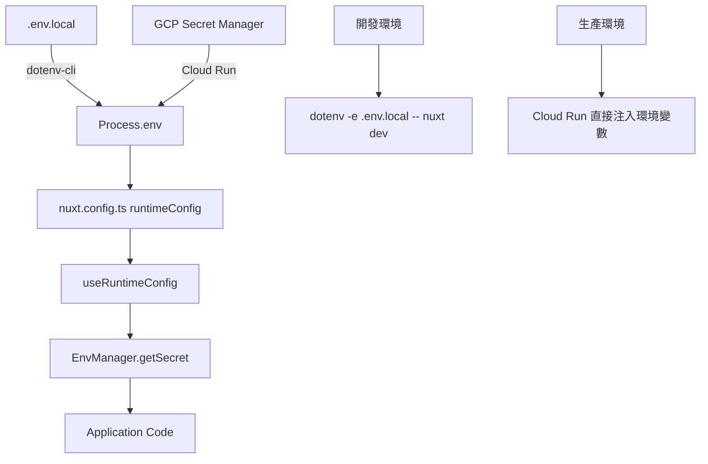
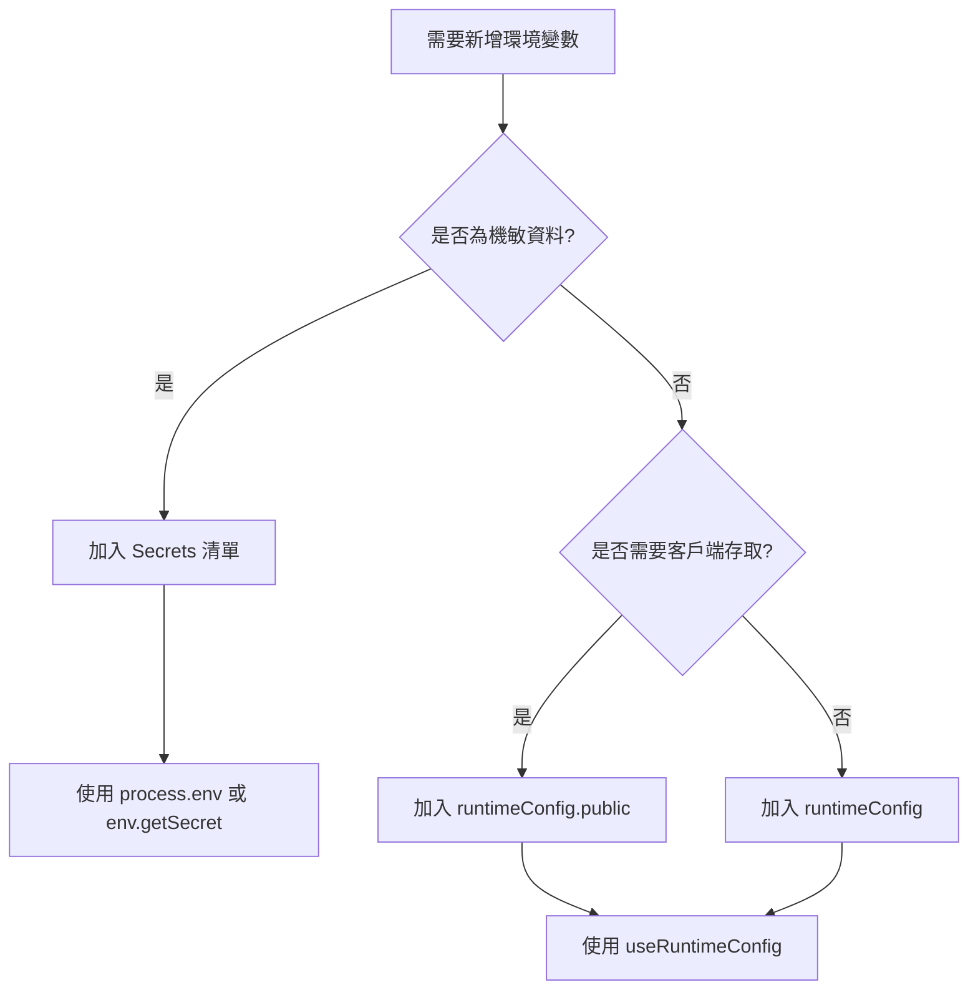

# 環境變數管理系統 - 設計文件

> 📅 文件版本：v2.0 📝 最後更新：2025-09-22 👥 設計團隊：Claude + Human
> 🎯 狀態：已實作

## 概述

本文件定義 SmartSurvey Pro 專案的環境變數管理策略，解決 Nuxt3 + Cloud Run + GCP
Secret Manager 整合的關鍵問題，確保機敏資料安全性與配置管理的一致性。

## 核心問題 ✅ 已解決

1. **Runtime vs Build-time**：✅ 使用 runtimeConfig + dotenv-cli 解決
2. **機敏資料管理**：✅ 透過 runtimeConfig 映射實現安全管理
3. **開發與生產環境**：✅ 本地 .env.local + 生產 Cloud Run 環境變數
4. **類型安全**：✅ EnvManager 提供完整 TypeScript 支援

## 系統架構

### 環境變數分層架構

```
┌─────────────────────────────────────────┐
│         應用層 (Application)            │
├─────────────────────────────────────────┤
│     環境變數管理器 (EnvManager)         │
├─────────┬───────────────┬───────────────┤
│  Secret │  RuntimeConfig │   Process.env │
│ Manager │   (Nuxt)      │   (Node.js)   │
└─────────┴───────────────┴───────────────┘
```

### 最新資料流向 🆕



## 環境變數分類規則

### 🔴 機敏資料 (Secrets) - 使用 `runtimeConfig` 映射 🆕

**定義**：任何洩漏會造成安全風險的資料

**⚠️ 重要變更**：不再直接使用 `process.env`，改用 `runtimeConfig` 映射

**管理方式**：

- 開發環境：`.env.local` → `dotenv-cli` → `process.env` → `runtimeConfig`
- 生產環境：Cloud Run 環境變數 → `process.env` → `runtimeConfig`
- 存取方式：`EnvManager.getSecret()` → `useRuntimeConfig()`

**已實作清單**：

```typescript
// 認證相關 ✅ 已實作
JWT_SECRET; // JWT 簽名密鑰
JWT_REFRESH_SECRET; // Refresh Token 密鑰

// 資料庫 ✅ 已實作
MONGODB_URI; // MongoDB 連接字串
MONGODB_DB_NAME; // MongoDB 資料庫名稱

// Redis (可選) ✅ 已實作
REDIS_URL; // Redis 連接字串
ENABLE_REDIS_CACHE; // 是否啟用 Redis

// 待擴充 (Phase 2+)
SESSION_SECRET; // Session 加密密鑰
STRIPE_SECRET_KEY; // Stripe 私鑰
SENDGRID_API_KEY; // SendGrid API 密鑰
OPENAI_API_KEY; // OpenAI API 密鑰
```

### 🟡 配置資料 (Configs) - 使用 `useRuntimeConfig`

**定義**：非機敏的配置資料，可公開或半公開

**管理方式**：

- 定義在 `nuxt.config.ts`
- 透過 `NUXT_` 前綴環境變數覆蓋
- 存取方式：`useRuntimeConfig()`

**清單**：

```typescript
// 伺服器端配置 (runtimeConfig)
APP_ENV; // development/staging/production
LOG_LEVEL; // debug/info/warn/error
RATE_LIMIT_MAX; // API 速率限制
CACHE_TTL; // 快取過期時間
BATCH_SIZE; // 批次處理大小

// 客戶端配置 (runtimeConfig.public)
NUXT_PUBLIC_API_BASE; // API 基礎路徑
NUXT_PUBLIC_APP_NAME; // 應用名稱
NUXT_PUBLIC_VERSION; // 應用版本
NUXT_PUBLIC_GA_ID; // Google Analytics ID
NUXT_PUBLIC_SENTRY_DSN; // Sentry DSN（公開部分）
```

## 實作策略 ✅ 已完成

### 1. 環境變數管理器 (EnvManager) - 最新實作

```typescript
// server/utils/env-manager.ts ✅ 已實作
export class EnvManager {
  private static instance: EnvManager;
  private validated = false;

  static getInstance(): EnvManager {
    if (!this.instance) {
      this.instance = new EnvManager();
    }
    return this.instance;
  }

  // 🆕 新實作：通過 runtimeConfig 映射取得機敏資料
  getSecret(key: string): string {
    try {
      const config = useRuntimeConfig();
      const secretMap: Record<string, string> = {
        JWT_SECRET: config.jwtSecret,
        JWT_REFRESH_SECRET: config.jwtRefreshSecret,
        MONGODB_URI: config.mongodbUri,
        MONGODB_DB_NAME: config.mongodbDbName,
        REDIS_URL: config.redisUrl,
        ENABLE_REDIS_CACHE: config.enableRedisCache,
        APP_NAME: config.appName,
        NODE_ENV: config.nodeEnv,
      };

      const value = secretMap[key];
      if (!value) {
        throw new Error(`缺少必要的環境變數: ${key}`);
      }
      return value;
    } catch (error) {
      throw new Error(
        `無法存取環境變數 ${key}：請確保在 Nuxt server context 中使用`
      );
    }
  }

  // 🆕 安全的環境變數取得（允許預設值）
  getSecretSafe(key: string, defaultValue = ''): string {
    try {
      return this.getSecret(key);
    } catch {
      return defaultValue;
    }
  }

  // 🆕 取得資料庫配置
  getDatabaseConfig() {
    return {
      mongoUri: this.getSecret('MONGODB_URI'),
      dbName: this.getSecret('MONGODB_DB_NAME'),
    };
  }

  // 🆕 取得 JWT 配置
  getJwtConfig() {
    return {
      accessTokenSecret: this.getSecret('JWT_SECRET'),
      refreshTokenSecret: this.getSecret('JWT_REFRESH_SECRET'),
      accessTokenExpiry: '15m',
      refreshTokenExpiry: '7d',
    };
  }

  // 啟動時驗證
  validateRequired(): void {
    if (this.validated) return;

    const requiredSecrets = [
      'JWT_SECRET',
      'JWT_REFRESH_SECRET',
      'MONGODB_URI',
      'MONGODB_DB_NAME',
    ];

    for (const key of requiredSecrets) {
      try {
        this.getSecret(key);
      } catch (error) {
        throw new Error(`環境變數驗證失敗: ${key}`);
      }
    }

    this.validated = true;
  }
}

export const env = EnvManager.getInstance();
```

### 2. Nuxt 配置 - 最新實作 ✅

```typescript
// nuxt.config.ts ✅ 已實作
export default defineNuxtConfig({
  runtimeConfig: {
    // 🔴 機敏資料 - 透過 runtimeConfig 映射
    jwtSecret: process.env.JWT_SECRET || '',
    jwtRefreshSecret: process.env.JWT_REFRESH_SECRET || '',
    mongodbUri: process.env.MONGODB_URI || '',
    mongodbDbName: process.env.MONGODB_DB_NAME || 'smartsurvey-dev',
    redisUrl: process.env.REDIS_URL || '',
    enableRedisCache: process.env.ENABLE_REDIS_CACHE || 'false',

    // 🟡 一般配置
    appName: process.env.APP_NAME || 'SmartSurvey Pro',
    nodeEnv: process.env.NODE_ENV || 'development',

    // 🟢 公開配置 - 客戶端可存取
    public: {
      apiBase: '/api',
      appName: 'SmartSurvey Pro',
      version: '0.0.1',
    },
  },
});
```

### 3. 開發環境配置 - dotenv-cli 整合 ✅

```json
// package.json ✅ 已實作
{
  "scripts": {
    "dev": "dotenv -e .env.local -- nuxt dev"
  },
  "devDependencies": {
    "dotenv-cli": "^10.0.0"
  }
}
```

### 3. 環境檔案結構

```bash
# .env.example (進版控，作為範本)
JWT_SECRET=your-secret-here
MONGODB_URI=mongodb://localhost:27017/smartsurvey
NUXT_PUBLIC_API_BASE=/api

# .env.local (不進版控，本地開發)
JWT_SECRET=dev-secret-key-do-not-use-in-production
MONGODB_URI=mongodb://localhost:27017/smartsurvey-dev
NUXT_PUBLIC_API_BASE=http://localhost:3000/api

# .env.production (不進版控，僅作參考)
# 生產環境使用 Secret Manager，不使用檔案
```

### 4. Docker 部署策略

```dockerfile
# Dockerfile
FROM node:20-alpine AS builder
WORKDIR /app
COPY . .
RUN pnpm install --frozen-lockfile
# Build 階段不需要 secrets
RUN pnpm build

FROM node:20-alpine
WORKDIR /app
COPY --from=builder /app/.output .output
# Runtime 階段由 Cloud Run 注入環境變數
EXPOSE 3000
CMD ["node", ".output/server/index.mjs"]
```

```yaml
# cloud-run-service.yaml
apiVersion: serving.knative.dev/v1
kind: Service
metadata:
  name: smartsurvey-pro
spec:
  template:
    metadata:
      annotations:
        run.googleapis.com/execution-environment: gen2
    spec:
      containers:
        - image: gcr.io/PROJECT_ID/smartsurvey-pro
          env:
            # 配置類環境變數
            - name: APP_ENV
              value: production
            - name: NUXT_PUBLIC_API_BASE
              value: https://api.smartsurvey.pro
          # 機敏資料從 Secret Manager 注入
          - name: JWT_SECRET
            valueFrom:
              secretKeyRef:
                name: jwt-secret
                key: latest
          - name: MONGODB_URI
            valueFrom:
              secretKeyRef:
                name: mongodb-uri
                key: latest
```

## 使用指南

### 開發者使用流程

#### 1. 判斷環境變數類型



#### 2. 實際使用範例 🆕

```typescript
// ✅ 新正確方式：透過 EnvManager 統一管理
import { env } from '~/server/utils/env-manager';

// 機敏資料 - 統一透過 env.getSecret()
const jwtSecret = env.getSecret('JWT_SECRET');
const mongoUri = env.getSecret('MONGODB_URI');

// 安全取得（允許預設值）
const redisUrl = env.getSecretSafe('REDIS_URL', '');

// 整組配置取得
const dbConfig = env.getDatabaseConfig();
const jwtConfig = env.getJwtConfig();

// 公開配置 - 直接使用 useRuntimeConfig
const config = useRuntimeConfig();
const apiBase = config.public.apiBase;

// ❌ 不再建議：直接使用 process.env（會有 context 問題）
// const jwtSecret = process.env.JWT_SECRET; // 可能在某些 context 下無法取得

// ❌ 不再建議：直接使用 config.jwtSecret（繞過 EnvManager 驗證）
// const jwtSecret = config.jwtSecret;
```

### 新增環境變數 SOP

1. **評估資料類型**
   - 機敏？→ Secrets 類別
   - 公開？→ Configs 類別

2. **更新文件**
   - 更新本設計文件的環境變數清單
   - 更新 `.env.example`

3. **實作存取**
   - Secrets：透過 `env.getSecret()`
   - Configs：透過 `useRuntimeConfig()`

4. **設定 Secret Manager**（生產環境）

   ```bash
   gcloud secrets create jwt-secret --data-file=-
   gcloud secrets add-iam-policy-binding jwt-secret \
     --member="serviceAccount:SERVICE_ACCOUNT" \
     --role="roles/secretmanager.secretAccessor"
   ```

5. **更新 Cloud Run 配置**
   - 添加環境變數映射
   - 部署新版本

## 測試策略

### 單元測試

```typescript
// test/server/utils/env-manager.test.ts
describe('EnvManager', () => {
  beforeEach(() => {
    process.env.TEST_SECRET = 'test-value';
  });

  it('should get secret from process.env', () => {
    const value = env.getSecret('TEST_SECRET');
    expect(value).toBe('test-value');
  });

  it('should throw on missing secret', () => {
    expect(() => env.getSecret('MISSING')).toThrow();
  });
});
```

### 整合測試

```typescript
// test/integration/auth.test.ts
describe('Authentication with env vars', () => {
  it('should use JWT_SECRET for signing', async () => {
    process.env.JWT_SECRET = 'test-secret';
    const token = generateAccessToken({ userId: '123' });
    expect(token).toBeDefined();
  });
});
```

## 安全性考量

1. **Secrets 永不進版控**
   - `.gitignore` 包含所有 `.env*` 檔案（除了 `.env.example`）
   - 使用 git-secrets 掃描工具

2. **最小權限原則**
   - Cloud Run Service Account 只有必要的 Secret Manager 權限
   - 每個 secret 獨立管理權限

3. **輪替機制**
   - JWT_SECRET 每季輪替
   - API Keys 定期更新
   - 建立輪替 SOP

4. **審計追蹤**
   - Cloud Audit Logs 記錄 secret 存取
   - 監控異常存取模式

## 故障排除

### 常見問題

**Q1: Cloud Run 部署後環境變數讀不到？**

- 檢查 Secret Manager 權限設定
- 確認 Service Account 有存取權限
- 驗證環境變數名稱是否正確

**Q2: useRuntimeConfig 在 build 時就固定了？**

- 使用 `NUXT_` 前綴覆蓋
- 確保是在 server 端使用（非 public）

**Q3: TypeScript 類型錯誤？**

- 更新 `env.d.ts` 類型定義
- 使用 `env.getSecret()` 確保類型安全

## 遷移計劃 ✅ 大部分已完成

### Phase 1（已完成 ✅）

- [x] 建立環境變數分類
- [x] 實作 EnvManager
- [x] 遷移現有環境變數到 runtimeConfig
- [x] 整合 dotenv-cli 支援開發環境
- [x] 實作統一的環境變數驗證機制
- [x] 建立完整的使用指南和 SOP

### Phase 2（第2月） 🔄

- [x] 驗證 Cloud Run 部署架構（設計階段完成）
- [ ] 整合 Secret Manager（生產部署時實作）
- [ ] 建立 CI/CD 管線
- [ ] 實作 secret 輪替

### Phase 3（第3月） 📅

- [ ] 監控與告警
- [ ] 自動化 secret 管理
- [ ] 災難復原計劃

## 參考資料

- [Nuxt Runtime Config](https://nuxt.com/docs/api/configuration/nuxt-config#runtimeconfig)
- [GCP Secret Manager](https://cloud.google.com/secret-manager/docs)
- [Cloud Run Environment Variables](https://cloud.google.com/run/docs/configuring/environment-variables)
- [12 Factor App - Config](https://12factor.net/config)

---

_此文件是環境變數管理的核心設計規範，所有環境變數相關的實作都必須遵循此文件_
