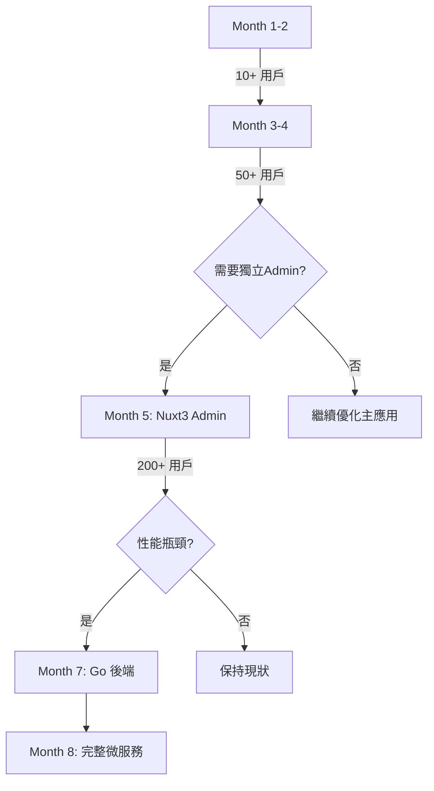

# SmartSurvey Pro - 開發階段規劃文檔 v2.0

> 📅 文件版本：v2.0  
> 📝 最後更新：2025-01-10  
> 👥 開發團隊：2人團隊  
> 🏗️ 架構策略：Monorepo + 漸進式開發

---

## 📊 執行摘要

本文檔定義了 SmartSurvey Pro 的 8 個月開發計劃，採用
**Monorepo 架構**與**漸進式開發策略**，確保快速交付 MVP 的同時為未來擴展預留空間。

### 核心原則

- **YAGNI (You Aren't Gonna Need It)**：不過度工程
- **漸進式演進**：根據實際需求擴展架構
- **快速驗證**：2個月內上線 MVP
- **數據驅動**：基於用戶反饋調整方向

---

## 🏗️ 技術架構規劃

### Monorepo 結構演進

```
初期（Phase 1-2）：精簡結構
├── apps/web/          # Nuxt3 主應用（95% 代碼）
├── packages/shared/   # 共享類型定義（5% 代碼）

中期（Phase 3-4）：適度擴展
├── apps/web/
├── apps/admin/        # 簡單管理介面（Nuxt3）
├── packages/shared/
├── packages/ui/       # UI 組件庫
├── packages/core/     # 業務邏輯

後期（Phase 5-8）：完整架構
├── apps/web/
├── apps/admin/        # 獨立後台（Vite+Vue3）
├── services/admin-api/# Go 後端（Phase 6+）
├── packages/*         # 多個功能包
```

### 技術棧時間線

| 階段      | 前端           | 後端             | 資料庫          | 部署           |
| --------- | -------------- | ---------------- | --------------- | -------------- |
| Phase 1-2 | Nuxt3 + Vue3   | Nitro (Nuxt內建) | MongoDB         | Vercel/Netlify |
| Phase 3-4 | + Pinia + UI庫 | Nitro + Redis    | MongoDB + Redis | Docker + GCP   |
| Phase 5-6 | + Vite (Admin) | + Go (部分API)   | + 分析資料庫    | + K8s          |
| Phase 7-8 | + Mobile Web   | Go 微服務        | + ElasticSearch | + CDN          |

---

## 📅 Phase 1: MVP Foundation（第1-2個月）

### 🎯 目標

- 可運行的問卷建構器
- 10個測試用戶
- 驗證核心價值主張

### 📦 開發範圍

#### Week 1-2: 專案初始化與基礎架構

```bash
# Monorepo 結構
survey-builder/
├── apps/web/           # 所有功能都在這
├── packages/shared/    # 只放類型定義
│   └── types/
│       ├── survey.ts
│       ├── question.ts
│       └── user.ts
```

**實作項目**：

- [x] Monorepo 初始化（Turborepo + PNPM）
- [x] Nuxt3 專案設置
- [x] Tailwind CSS 配置
- [x] 基礎認證系統（JWT）
- [x] MongoDB 連接設置
- [x] 基礎 Layout 和路由

#### Week 3-4: 核心拖拽功能

**實作項目**：

- [x] 拖拽畫布組件
- [x] 5種基礎題型（單選、多選、文字、評分、日期）
- [x] 題目屬性面板
- [x] 即時預覽功能
- [x] 自動保存機制

#### Week 5-6: 數據收集系統

**實作項目**：

- [x] 問卷發布 API
- [x] 回應收集頁面
- [x] 基礎驗證邏輯
- [x] 進度保存功能
- [x] 簡單的防重複提交

#### Week 7-8: 基礎分析與部署

**實作項目**：

- [x] 簡單統計圖表（Chart.js）
- [x] CSV 數據導出
- [x] 響應式設計優化
- [x] 部署到 Vercel/Netlify
- [x] 基礎 SEO 設置

### 📊 關鍵指標

- 技術債務：< 20%
- 測試覆蓋率：> 60%
- 載入時間：< 3秒
- 可用性：> 95%

### 💰 資源分配

- 前端開發：60%
- 後端 API：30%
- 部署與測試：10%

---

## 📅 Phase 2: Core Features（第3-4個月）

### 🎯 目標

- 50個活躍用戶
- 實現差異化功能
- 收集付費意願

### 📦 開發範圍

#### Week 9-10: AI 智能功能

**架構調整**：

```bash
packages/
├── shared/
│   ├── types/
│   └── utils/        # 新增：共用工具函數
```

**實作項目**：

- [x] OpenAI API 整合
- [x] 智能問卷生成器
- [x] 問題優化建議
- [x] 智能數據分析
- [x] Token 使用量管理

#### Week 11-12: 實時協作基礎

**實作項目**：

- [x] WebSocket 基礎設施
- [x] 游標即時同步
- [x] 基礎衝突解決
- [x] 協作者列表顯示
- [x] 簡單的評論系統

#### Week 13-14: 題型擴展與邏輯

**架構調整**：

```bash
packages/
├── shared/
├── ui/               # 新增：抽離可複用組件
│   └── components/
│       ├── Button/
│       ├── Input/
│       └── Modal/
```

**實作項目**：

- [x] 新增10種進階題型
- [x] 條件邏輯引擎
- [x] 跳轉規則設置
- [x] 動態內容管道
- [x] 進階驗證規則

#### Week 15-16: 團隊協作功能

**實作項目**：

- [x] 團隊管理系統
- [x] 基礎權限控制
- [x] 問卷分享機制
- [x] 活動日誌
- [x] 簡單的 Admin 頁面（Nuxt3 內）

### 📊 關鍵指標

- 用戶留存率：> 40%
- AI 功能使用率：> 30%
- 協作功能使用率：> 20%
- 系統穩定性：> 98%

---

## 📅 Phase 3: Professional Platform（第5-6個月）

### 🎯 目標

- 200個付費用戶
- 企業級功能完善
- 建立品牌認知

### 📦 開發範圍

#### Week 17-18: 獨立管理後台

**架構調整**：

```bash
apps/
├── web/              # 用戶端
├── admin/            # 新增：管理後台（初期用 Nuxt3）
packages/
├── shared/
├── ui/
├── core/             # 新增：核心業務邏輯
│   ├── survey-engine/
│   └── analytics/
```

**實作項目**：

- [x] 獨立的 Admin 應用（Nuxt3）
- [x] 用戶管理介面
- [x] 內容審核系統
- [x] 系統監控儀表板
- [x] 基礎數據分析

#### Week 19-20: 進階分析功能

**實作項目**：

- [x] 交叉分析工具
- [x] 趨勢分析圖表
- [x] 自定義報告生成
- [x] 數據分群功能
- [x] API 數據導出

#### Week 21-22: 企業功能

**實作項目**：

- [x] SSO 單點登入
- [x] 審批流程系統
- [x] 白標功能（基礎）
- [x] SLA 監控
- [x] 備份恢復機制

#### Week 23-24: 性能優化

**實作項目**：

- [x] Redis 快取層
- [x] CDN 整合
- [x] 圖片優化服務
- [x] 資料庫索引優化
- [x] API 限流機制

### 📊 關鍵指標

- 付費轉換率：> 5%
- 平均客單價：$65/月
- 系統可用性：> 99.5%
- API 響應時間：< 200ms

---

## 📅 Phase 4: Scale & Expand（第7-8個月）

### 🎯 目標

- 500個付費用戶
- 國際市場擴展
- 建立技術壁壘

### 📦 開發範圍

#### Week 25-26: 微服務化準備

**架構調整**：

```bash
apps/
├── web/
├── admin/            # 遷移到 Vite + Vue3
services/             # 新增：微服務層
├── admin-api/        # Go 後端（開始開發）
│   ├── analytics/    # 分析服務
│   └── reports/      # 報告服務
```

**實作項目**：

- [x] Admin 前端遷移（Vite + Vue3）
- [x] Go 後端基礎架構
- [x] 分析服務分離
- [x] 消息隊列整合
- [x] 分散式追蹤

#### Week 27-28: 國際化與本地化

**實作項目**：

- [x] i18n 多語言支持
- [x] 多幣種支付
- [x] 地區合規性
- [x] 本地化內容
- [x] 時區處理

#### Week 29-30: 移動優化

**實作項目**：

- [x] PWA 功能
- [x] 移動端優化
- [x] 離線功能
- [x] 推送通知
- [x] App 殼（WebView）

#### Week 31-32: AI 進階與收尾

**實作項目**：

- [x] 自訓練模型整合
- [x] 預測分析功能
- [x] 智能推薦系統
- [x] 自動化測試完善
- [x] 文檔完善

### 📊 關鍵指標

- MRR：> $30,000
- 用戶滿意度：> 4.5/5
- 技術債務：< 15%
- 自動化覆蓋：> 80%

---

## 🚀 關鍵里程碑與決策點

### 架構演進決策樹



### 技術債務管理

| 階段    | 允許債務 | 償還策略     |
| ------- | -------- | ------------ |
| Phase 1 | 30%      | 快速開發優先 |
| Phase 2 | 25%      | 每週五重構   |
| Phase 3 | 20%      | 雙週重構衝刺 |
| Phase 4 | 15%      | 持續重構     |

---

## 👥 團隊分工建議

### Developer A（前端主導）

- **Phase 1-2**：UI/UX、拖拽系統、表單邏輯
- **Phase 3-4**：Admin 前端、數據可視化、性能優化

### Developer B（後端主導）

- **Phase 1-2**：API 設計、數據庫、認證系統
- **Phase 3-4**：Go 後端、微服務、AI 整合

### 協作點

- 每日站會（15分鐘）
- 週五架構評審
- 雙週回顧會議

---

## 📊 預算與資源規劃

### 開發成本（8個月）

- 人力成本：$80,000（2人 × $5,000 × 8月）
- 基礎設施：$4,000
- 第三方服務：$3,000
- 行銷預算：$5,000
- **總計：$92,000**

### 收入預測

- Month 4：$500（10個付費用戶）
- Month 6：$5,000（80個付費用戶）
- Month 8：$30,000（500個付費用戶）
- **累計：$50,000+**

---

## 🎯 成功標準

### 技術指標

✅ 程式碼品質分數 > 85  
✅ 自動化測試覆蓋 > 80%  
✅ 部署頻率 > 3次/週  
✅ 平均修復時間 < 4小時

### 業務指標

✅ 用戶滿意度 > 4.5/5  
✅ 月流失率 < 5%  
✅ 付費轉換率 > 5%  
✅ LTV/CAC > 3

### 團隊指標

✅ 開發速度穩定  
✅ 技術債務可控  
✅ 知識共享充分  
✅ 工作生活平衡

---

## 🚨 風險管理

### 技術風險

| 風險            | 影響 | 緩解策略                 |
| --------------- | ---- | ------------------------ |
| Monorepo 複雜度 | 中   | 漸進式擴展，保持簡單     |
| Go 學習曲線     | 低   | Phase 6 才開始，充分準備 |
| 擴展性問題      | 高   | 早期做好架構設計         |
| 第三方依賴      | 中   | 謹慎選擇，做好備案       |

### 市場風險

| 風險         | 影響 | 緩解策略               |
| ------------ | ---- | ---------------------- |
| 競爭對手     | 高   | 差異化功能，快速迭代   |
| 用戶需求變化 | 中   | 持續用戶訪談，敏捷調整 |
| 定價策略     | 中   | A/B 測試，動態調整     |

---

## 📝 下一步行動

### 立即行動（Week 1）

1. 初始化 Monorepo 結構
2. 設置開發環境
3. 創建基礎認證系統
4. 實現第一個拖拽原型

### 短期目標（Month 1）

1. 完成 MVP 核心功能
2. 部署測試環境
3. 邀請 10 個測試用戶
4. 收集初步反饋

### 檢查點

- **Week 2**：拖拽原型可用性評估
- **Week 4**：MVP 功能完整性檢查
- **Week 8**：用戶反饋總結與方向調整
- **Month 3**：付費意願驗證
- **Month 6**：商業模式驗證

---

## 🔄 文檔維護

本文檔為活文檔，將根據實際開發進度和市場反饋持續更新。

**更新週期**：

- 每兩週小更新
- 每月大版本更新
- 重大決策立即更新

**版本歷史**：

- v1.0 (2025-01-10)：初始版本
- v2.0 (2025-01-10)：加入 Monorepo 架構和漸進式 Admin 開發策略

---

_本文檔由開發團隊共同維護，最後更新：2025-01-10_
