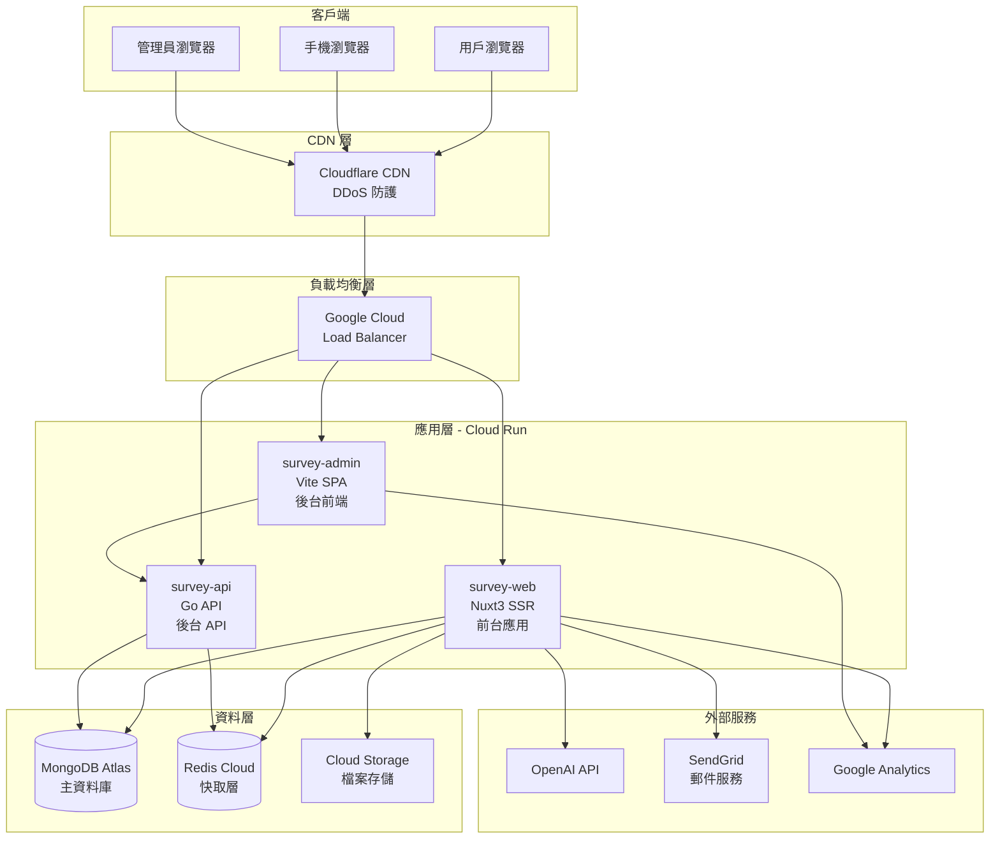
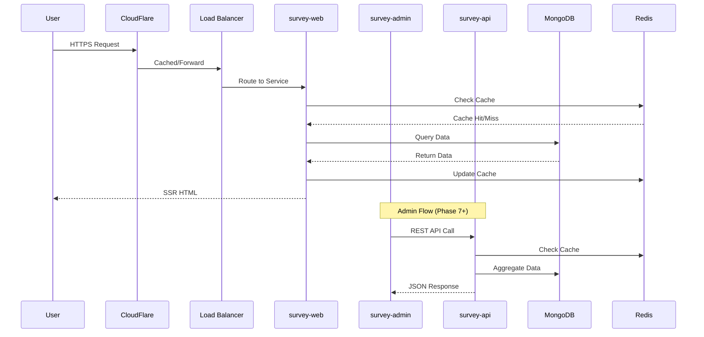
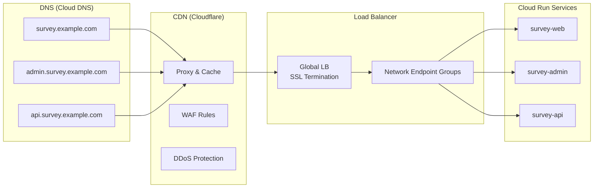
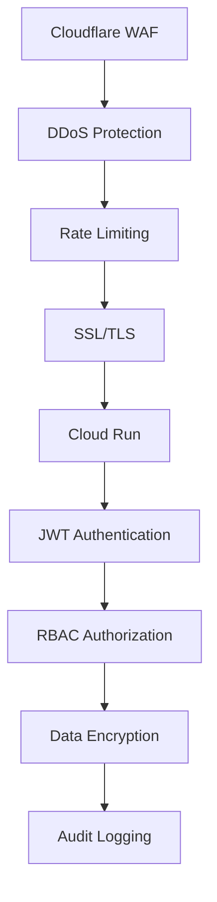
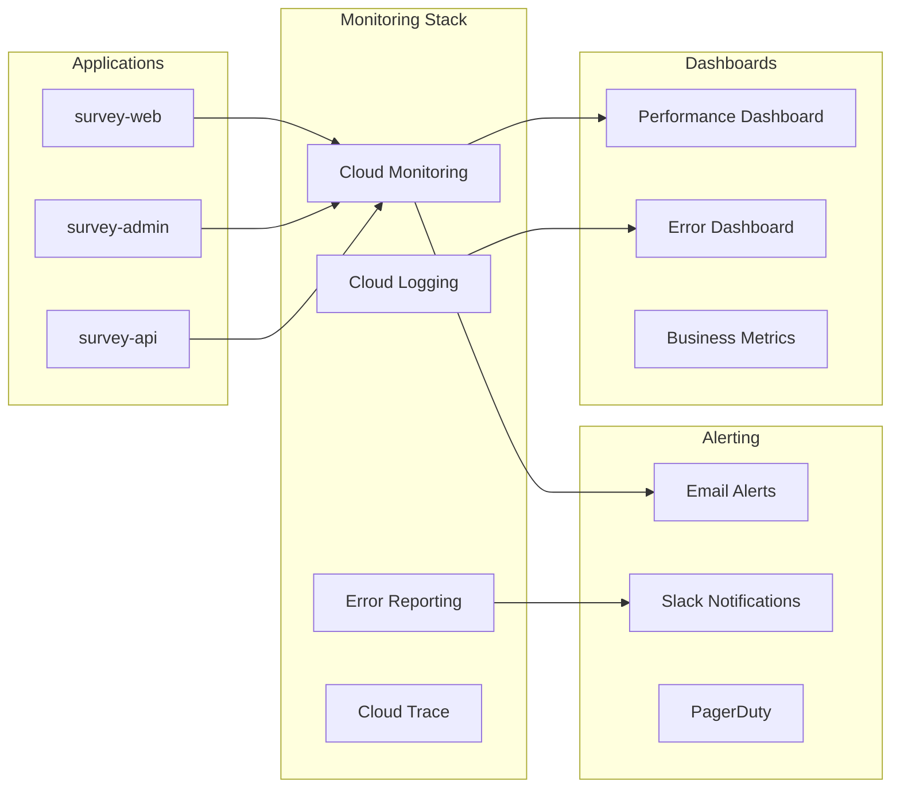
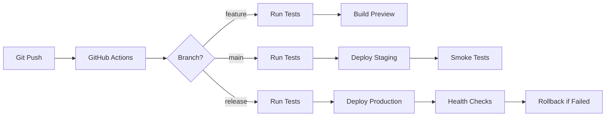
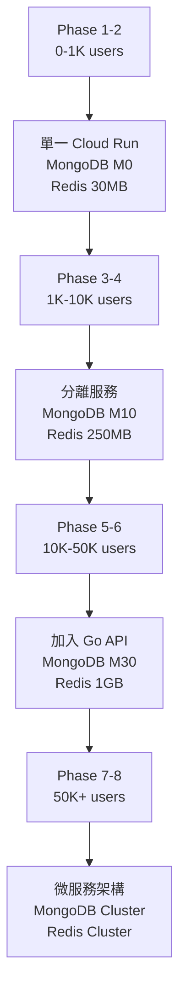
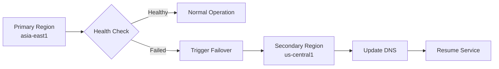
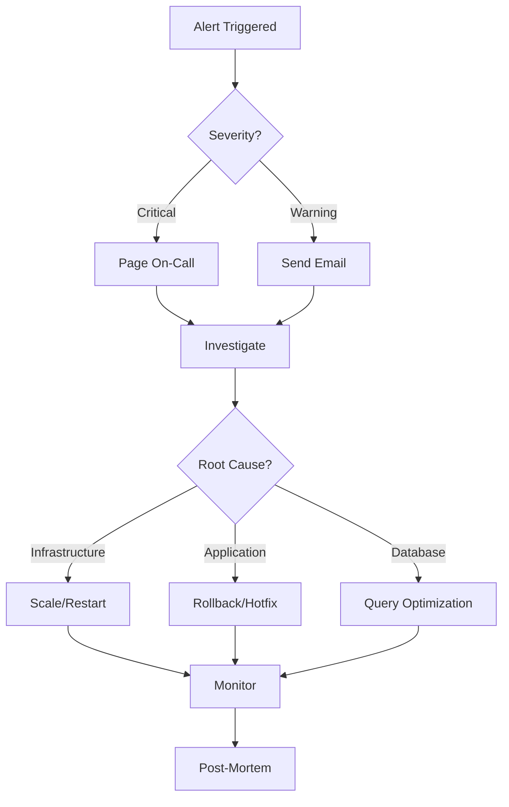

# SmartSurvey Pro - 系統架構設計文檔

> 📅 文件版本：v1.0  
> 📝 最後更新：2025-01-10  
> 🏗️ 架構模式：Microservices-ready Monorepo  
> ☁️ 部署平台：Google Cloud Platform

---

## 🌐 系統架構總覽

### 高層架構圖



---

## 🏗️ 應用架構設計

### 三層服務架構

| 服務名稱         | 技術棧        | 用途         | URL                      | 部署階段 |
| ---------------- | ------------- | ------------ | ------------------------ | -------- |
| **survey-web**   | Nuxt3 + Nitro | 用戶前台 SSR | survey.example.com       | Phase 1  |
| **survey-admin** | Vite + Vue3   | 管理後台 SPA | admin.survey.example.com | Phase 5  |
| **survey-api**   | Go + Gin      | 高性能 API   | api.survey.example.com   | Phase 7  |

### 服務間通訊



---

## ☁️ Google Cloud Platform 架構

### 資源配置

```yaml
# Cloud Run 配置
services:
  survey-web:
    region: asia-east1
    cpu: 1-2
    memory: 512Mi-1Gi
    min_instances: 1
    max_instances: 10
    concurrency: 80
    timeout: 60s

  survey-admin:
    region: asia-east1
    cpu: 1
    memory: 256Mi
    min_instances: 0
    max_instances: 3
    concurrency: 100
    timeout: 30s

  survey-api: # Phase 7+
    region: asia-east1
    cpu: 2-4
    memory: 1Gi-2Gi
    min_instances: 0
    max_instances: 5
    concurrency: 1000
    timeout: 300s
```

### 網路架構



### Cloud Run 部署配置

```dockerfile
# apps/web/Dockerfile
FROM node:18-alpine AS builder
WORKDIR /app
COPY package*.json ./
RUN npm ci
COPY . .
RUN npm run build

FROM node:18-alpine
WORKDIR /app
COPY --from=builder /app/.output .
EXPOSE 3000
CMD ["node", "server/index.mjs"]
```

```yaml
# cloudbuild.yaml
steps:
  # Build and push survey-web
  - name: 'gcr.io/cloud-builders/docker'
    args:
      ['build', '-t', 'gcr.io/$PROJECT_ID/survey-web:$COMMIT_SHA', 'apps/web']

  - name: 'gcr.io/cloud-builders/docker'
    args: ['push', 'gcr.io/$PROJECT_ID/survey-web:$COMMIT_SHA']

  # Deploy to Cloud Run
  - name: 'gcr.io/google.com/cloudsdktool/cloud-sdk'
    entrypoint: gcloud
    args:
      - 'run'
      - 'deploy'
      - 'survey-web'
      - '--image=gcr.io/$PROJECT_ID/survey-web:$COMMIT_SHA'
      - '--region=asia-east1'
      - '--platform=managed'
      - '--allow-unauthenticated'
      - '--service-account=survey-web@$PROJECT_ID.iam.gserviceaccount.com'
      - '--set-env-vars=NODE_ENV=production'
      - '--set-secrets=MONGODB_URI=mongodb-uri:latest,REDIS_URL=redis-url:latest'

timeout: 1200s
```

---

## 🗄️ 資料架構

### MongoDB Atlas 配置

```javascript
// 連接配置
const mongoConfig = {
  cluster: 'survey-cluster',
  region: 'gcp-asia-east1',
  tier: 'M10', // 初期
  // M30 當用戶 > 10000

  database: 'survey_db',
  collections: {
    users: 'users',
    surveys: 'surveys',
    responses: 'responses',
    teams: 'teams',
    analytics: 'analytics',
  },

  // 連接設定
  connection: {
    retryWrites: true,
    w: 'majority',
    readPreference: 'primaryPreferred',
    maxPoolSize: 50,
  },
};
```

### 資料庫 Schema

```typescript
// MongoDB Collections Schema

// users collection
interface User {
  _id: ObjectId;
  email: string;
  password: string; // bcrypt hashed
  profile: {
    name: string;
    avatar?: string;
    timezone: string;
    language: string;
  };
  subscription: {
    plan: 'free' | 'pro' | 'team' | 'enterprise';
    validUntil: Date;
    usage: {
      surveys: number;
      responses: number;
    };
  };
  teams: ObjectId[];
  createdAt: Date;
  updatedAt: Date;
  lastLogin: Date;
}

// surveys collection
interface Survey {
  _id: ObjectId;
  title: string;
  description?: string;
  createdBy: ObjectId;
  teamId?: ObjectId;
  status: 'draft' | 'published' | 'closed' | 'archived';

  questions: Question[];
  theme: Theme;
  settings: {
    allowMultipleResponses: boolean;
    requireLogin: boolean;
    password?: string;
    startDate?: Date;
    endDate?: Date;
    responseLimit?: number;
  };

  logic: LogicRule[];

  stats: {
    views: number;
    starts: number;
    completions: number;
    avgCompletionTime: number;
  };

  version: number;
  versions: Version[];

  createdAt: Date;
  updatedAt: Date;
  publishedAt?: Date;
}

// responses collection
interface Response {
  _id: ObjectId;
  surveyId: ObjectId;
  surveyVersion: number;

  respondent?: {
    userId?: ObjectId;
    sessionId: string;
    ip: string;
    userAgent: string;
    location?: {
      country: string;
      city: string;
    };
  };

  answers: Answer[];

  metadata: {
    startTime: Date;
    submitTime: Date;
    completionTime: number; // seconds
    device: 'desktop' | 'tablet' | 'mobile';
    browser: string;
  };

  status: 'in_progress' | 'completed' | 'abandoned';

  createdAt: Date;
  updatedAt: Date;
}

// teams collection
interface Team {
  _id: ObjectId;
  name: string;
  owner: ObjectId;

  members: {
    userId: ObjectId;
    role: 'owner' | 'admin' | 'editor' | 'viewer';
    joinedAt: Date;
  }[];

  settings: {
    allowedDomains?: string[];
    ssoEnabled: boolean;
  };

  subscription: {
    plan: 'team' | 'enterprise';
    seats: number;
    validUntil: Date;
  };

  createdAt: Date;
  updatedAt: Date;
}
```

### MongoDB 索引策略

```javascript
// 索引優化
db.users.createIndex({ email: 1 }, { unique: true });
db.users.createIndex({ 'subscription.plan': 1 });

db.surveys.createIndex({ createdBy: 1, status: 1 });
db.surveys.createIndex({ teamId: 1 });
db.surveys.createIndex({ 'stats.completions': -1 });

db.responses.createIndex({ surveyId: 1, status: 1 });
db.responses.createIndex({ 'respondent.userId': 1 });
db.responses.createIndex({ createdAt: -1 });

db.teams.createIndex({ 'members.userId': 1 });
```

### Redis Cloud 配置

```javascript
// Redis 使用策略
const redisConfig = {
  provider: 'Redis Cloud',
  region: 'gcp-asia-east1',
  plan: '30MB', // 免費層
  // 升級到 1GB 當需要時

  databases: {
    0: 'session', // 用戶 Session
    1: 'cache', // 一般快取
    2: 'rate_limit', // API 限流
    3: 'websocket', // WebSocket 狀態
    4: 'analytics', // 即時分析數據
  },
};

// 快取策略
const cacheStrategy = {
  // Session
  'session:*': {
    ttl: 7 * 24 * 60 * 60, // 7 天
    db: 0,
  },

  // Survey 快取
  'survey:*': {
    ttl: 60 * 60, // 1 小時
    db: 1,
  },

  // Response 統計
  'stats:*': {
    ttl: 5 * 60, // 5 分鐘
    db: 1,
  },

  // API 限流
  'rate:*': {
    ttl: 60, // 1 分鐘滑動窗口
    db: 2,
  },
};
```

---

## 🔐 安全架構

### 多層安全防護



### 安全配置

```yaml
# Security Headers (Cloudflare)
security_headers:
  X-Frame-Options: DENY
  X-Content-Type-Options: nosniff
  X-XSS-Protection: 1; mode=block
  Strict-Transport-Security: max-age=31536000; includeSubDomains
  Content-Security-Policy: default-src 'self'

# Cloud Run Security
service_account_permissions:
  survey-web:
    - storage.objects.create
    - storage.objects.get
    - secretmanager.versions.access

  survey-admin:
    - storage.objects.list
    - monitoring.timeSeries.list

  survey-api:
    - storage.admin
    - monitoring.admin

# Secrets Management
secrets:
  - mongodb-uri
  - redis-url
  - jwt-secret
  - openai-api-key
  - sendgrid-api-key
```

---

## 📊 監控與日誌

### 監控架構



### 關鍵指標 (KPIs)

```yaml
# 系統指標
system_metrics:
  - cpu_utilization: < 70%
  - memory_utilization: < 80%
  - request_latency_p95: < 500ms
  - error_rate: < 1%
  - availability: > 99.9%

# 業務指標
business_metrics:
  - daily_active_users
  - survey_creation_rate
  - response_submission_rate
  - completion_rate
  - api_usage_by_endpoint

# 告警規則
alerts:
  - name: high_error_rate
    condition: error_rate > 5%
    duration: 5m
    severity: critical

  - name: high_latency
    condition: latency_p95 > 1000ms
    duration: 10m
    severity: warning

  - name: low_disk_space
    condition: disk_usage > 90%
    severity: critical
```

---

## 🚀 部署策略

### 環境配置

| 環境            | 用途       | URL                        | 自動部署        |
| --------------- | ---------- | -------------------------- | --------------- |
| **Development** | 開發測試   | dev.survey.example.com     | 每次 commit     |
| **Staging**     | 預發布測試 | staging.survey.example.com | PR 合併到 main  |
| **Production**  | 正式環境   | survey.example.com         | 手動觸發 + 審核 |

### CI/CD Pipeline



### 部署腳本

```bash
#!/bin/bash
# deploy.sh - 部署腳本

set -e

PROJECT_ID="survey-builder"
REGION="asia-east1"
SERVICE=$1
ENVIRONMENT=$2

# 構建映像
docker build -t gcr.io/${PROJECT_ID}/${SERVICE}:${GITHUB_SHA} .

# 推送到 Container Registry
docker push gcr.io/${PROJECT_ID}/${SERVICE}:${GITHUB_SHA}

# 部署到 Cloud Run
gcloud run deploy ${SERVICE}-${ENVIRONMENT} \
  --image gcr.io/${PROJECT_ID}/${SERVICE}:${GITHUB_SHA} \
  --region ${REGION} \
  --platform managed \
  --memory 1Gi \
  --min-instances 0 \
  --max-instances 10 \
  --allow-unauthenticated \
  --set-env-vars="NODE_ENV=${ENVIRONMENT}" \
  --set-secrets="MONGODB_URI=mongodb-uri-${ENVIRONMENT}:latest" \
  --set-secrets="REDIS_URL=redis-url-${ENVIRONMENT}:latest"

echo "Deployment complete!"
```

---

## 📈 擴展策略

### 垂直擴展路徑



### 水平擴展策略

| 用戶規模 | Cloud Run       | MongoDB | Redis     | 預估成本/月 |
| -------- | --------------- | ------- | --------- | ----------- |
| 0-1K     | 1 instance      | M0 Free | 30MB Free | $0-10       |
| 1K-10K   | 2-5 instances   | M10     | 250MB     | $100        |
| 10K-50K  | 5-10 instances  | M30     | 1GB       | $500        |
| 50K-100K | 10-20 instances | M40     | 5GB       | $1500       |
| 100K+    | 20+ instances   | Cluster | Cluster   | $3000+      |

---

## 🔄 災難恢復

### 備份策略

```yaml
backup_strategy:
  mongodb:
    continuous: true # Atlas 持續備份
    point_in_time: 24h
    snapshots: daily
    retention: 30_days

  cloud_storage:
    versioning: enabled
    lifecycle:
      - action: delete
        condition:
          age: 90

  redis:
    persistence: RDB + AOF
    backup_frequency: hourly
    retention: 7_days
```

### 故障切換



---

## 🛠️ 維運手冊

### 日常維護

| 任務     | 頻率   | 負責人   | 工具              |
| -------- | ------ | -------- | ----------------- |
| 監控檢查 | 每日   | DevOps   | Cloud Console     |
| 日誌審查 | 每週   | DevOps   | Cloud Logging     |
| 性能優化 | 每月   | 開發團隊 | APM Tools         |
| 安全審計 | 每季   | 安全團隊 | Security Scanner  |
| 災難演練 | 每半年 | 全團隊   | Chaos Engineering |

### 故障處理流程



---

## 📋 技術債務追蹤

| 項目              | 優先級 | 影響       | 計劃解決時間 |
| ----------------- | ------ | ---------- | ------------ |
| 添加 API Gateway  | Medium | API 管理   | Phase 5      |
| 實施 Service Mesh | Low    | 微服務通訊 | Phase 8      |
| 多區域部署        | Medium | 可用性     | Phase 6      |
| GraphQL 支援      | Low    | API 靈活性 | Future       |
| Kubernetes 遷移   | Low    | 複雜度     | Future       |

---

## 🎯 架構決策記錄 (ADR)

### ADR-001: 選擇 Cloud Run 而非 Kubernetes

**決策**: 使用 Cloud Run 作為主要計算平台

**原因**:

1. 簡化運維，無需管理集群
2. 自動擴展，包括縮放到零
3. 按使用付費，成本效益高
4. 內建 HTTPS 和負載均衡

**後果**:

- ✅ 降低運維成本
- ✅ 快速部署和迭代
- ⚠️ 某些高級功能受限
- ⚠️ 冷啟動可能影響首次請求

### ADR-002: MongoDB Atlas 而非自建資料庫

**決策**: 使用 MongoDB Atlas 託管服務

**原因**:

1. 自動備份和恢復
2. 內建監控和告警
3. 輕鬆擴展
4. 全球分佈式部署

**後果**:

- ✅ 減少資料庫管理工作
- ✅ 高可用性保證
- ⚠️ 成本較自建略高
- ⚠️ 某些配置受限

### ADR-003: Monorepo 架構

**決策**: 採用 Monorepo 管理所有服務

**原因**:

1. 代碼共享容易
2. 統一的構建和測試
3. 原子化提交
4. 簡化依賴管理

**後果**:

- ✅ 提高開發效率
- ✅ 確保版本一致性
- ⚠️ 倉庫體積增大
- ⚠️ CI/CD 複雜度增加

---

## 📚 參考資源

- [Cloud Run 文檔](https://cloud.google.com/run/docs)
- [MongoDB Atlas 最佳實踐](https://www.mongodb.com/docs/atlas/)
- [Redis Cloud 文檔](https://redis.com/redis-enterprise-cloud/)
- [Cloudflare 配置指南](https://developers.cloudflare.com/)
- [GCP 架構框架](https://cloud.google.com/architecture/framework)

---

_本文檔為 SmartSurvey Pro 系統架構設計的核心參考，將隨項目發展持續更新_
