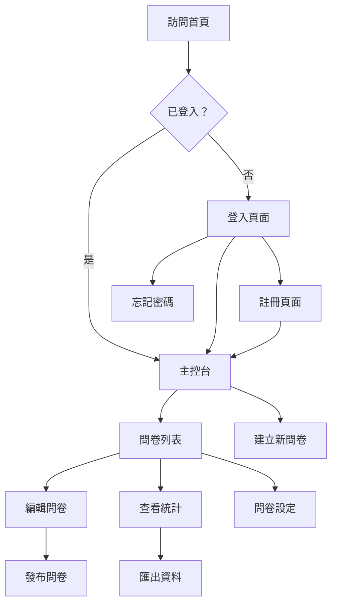

# 6. 前端頁面補全

## 📊 概覽

- **階段**: Phase 1
- **優先級**: 🔴 Critical
- **狀態**: ⬜ 未開始
- **預估工時**: 24h
- **實際工時**: 0h
- **進度**: 0% ░░░░░░░░░░░░░░░░░░░░
- **開始日期**: 2025-01-24
- **完成日期**: -

## 🔗 依賴關係

- **前置任務**: 2.用戶認證系統 (✅)、3.問卷建構器系統 (✅)
- **阻塞任務**: 無（Phase 1 最終任務）
- **相關文件**:
  - [業務邏輯規則](../../../smartsurvey-business-logic.md#用戶流程)
  - [API 參考手冊](../../../smartsurvey-api-reference.md#認證-apis)
  - [頁面缺失分析](../../../smartsurvey-roadmap.md#頁面缺失分析)

## 📚 學習目標

- [ ] 掌握 Nuxt 3 頁面路由和佈局系統
- [ ] 理解 Vue 3 組合式 API 在頁面級別的應用
- [ ] 學會前後端 API 整合和錯誤處理
- [ ] 掌握響應式設計和用戶體驗優化
- [ ] 理解單頁應用的狀態管理和頁面間通信

## 🏗️ 任務分解

### 6.1 認證系統頁面 [8h]

**狀態**: ⬜ **優先級**: 🔴 Critical

#### 6.1.1 登入頁面

- **預估**: 2h | **實際**: -
- **狀態**: ⬜
- **預計開始**: 2025-01-24
- **負責**: Claude + Human

**任務說明**: 建立完整的用戶登入頁面

**技術要求**:

```vue
<!-- /app/pages/auth/login.vue -->
<template>
  <div class="min-h-screen flex items-center justify-center bg-gray-50">
    <div class="max-w-md w-full space-y-8">
      <div>
        <h2 class="mt-6 text-center text-3xl font-extrabold text-gray-900">
          登入您的帳戶
        </h2>
      </div>
      <form class="mt-8 space-y-6" @submit.prevent="handleLogin">
        <!-- TODO(human): 實作登入表單 -->
      </form>
    </div>
  </div>
</template>
```

**功能需求**:

- [x] 電子郵件輸入欄位（含格式驗證）
- [x] 密碼輸入欄位（含顯示/隱藏切換）
- [x] 記住我選項
- [x] 忘記密碼連結
- [x] 登入按鈕（含載入狀態）
- [x] 錯誤訊息顯示
- [x] 註冊頁面連結
- [x] 響應式設計（手機/平板/桌面）

**API 整合**:

- 使用現有 `/api/auth/login.post.ts`
- 成功後重定向到 `/dashboard`
- 錯誤處理和友善提示
- JWT Token 儲存管理

**設計參考**: Auth0、Firebase Auth 的登入頁面設計

#### 6.1.2 註冊頁面

- **預估**: 2h | **實際**: -
- **狀態**: ⬜
- **預計開始**: 2025-01-24
- **負責**: Claude + Human

**任務說明**: 建立完整的用戶註冊頁面

**功能需求**:

- [x] 姓名輸入欄位
- [x] 電子郵件輸入欄位（含唯一性驗證）
- [x] 密碼輸入欄位（含強度指示器）
- [x] 確認密碼欄位
- [x] 服務條款同意選項
- [x] 註冊按鈕（含載入狀態）
- [x] 錯誤訊息顯示
- [x] 登入頁面連結
- [x] 響應式設計

**API 整合**:

- 使用現有 `/api/auth/register.post.ts`
- 即時驗證（電子郵件唯一性、密碼強度）
- 成功後自動登入並重定向
- 完整的錯誤處理

#### 6.1.3 忘記密碼頁面

- **預估**: 2h | **實際**: -
- **狀態**: ⬜
- **預計開始**: 2025-01-24
- **負責**: Claude + Human

**任務說明**: 建立密碼重設請求頁面

**注意**: API 端點尚未實作，此頁面為 UI 準備

**功能需求**:

- [x] 電子郵件輸入欄位
- [x] 發送重設連結按鈕
- [x] 成功提示訊息
- [x] 返回登入頁面連結
- [x] 預留重設密碼表單區域

**API 規劃**:

```typescript
// 未來實作 /api/auth/forgot-password.post.ts
// 未來實作 /api/auth/reset-password.post.ts
```

#### 6.1.4 認證流程整合與測試

- **預估**: 2h | **實際**: -
- **狀態**: ⬜
- **預計開始**: 2025-01-24
- **負責**: Claude + Human

**任務說明**: 整合認證流程並進行完整測試

**整合工作**:

- [x] 建立 `/composables/useAuth.ts` 統一認證邏輯
- [x] 整合 Pinia 認證狀態管理
- [x] 設定認證中間件保護
- [x] 登入/登出流程測試
- [x] 錯誤處理測試
- [x] 跨頁面狀態同步測試

### 6.2 用戶管理頁面 [6h]

**狀態**: ⬜ **優先級**: 🔴 Critical

#### 6.2.1 主控台/儀表板

- **預估**: 3h | **實際**: -
- **狀態**: ⬜
- **預計開始**: 2025-01-25
- **負責**: Claude + Human

**任務說明**: 建立用戶登入後的主要控制頁面

**頁面結構**:

```vue
<!-- /app/pages/dashboard.vue -->
<template>
  <div class="min-h-screen bg-gray-50">
    <DashboardHeader />
    <div class="max-w-7xl mx-auto py-6 sm:px-6 lg:px-8">
      <!-- TODO(human): 實作儀表板內容 -->
    </div>
  </div>
</template>
```

**功能需求**:

- [x] 歡迎訊息和用戶資訊
- [x] 問卷統計概覽（總數、回應數、最近活動）
- [x] 快速操作區域（建立新問卷、查看回應）
- [x] 最近問卷列表
- [x] 系統通知區域
- [x] 導航側邊欄
- [x] 響應式布局

**API 整合**:

- 使用 `/api/auth/me.get.ts` 取得用戶資訊
- 使用 `/api/surveys/index.get.ts` 取得問卷列表
- 統計資料快取和即時更新

#### 6.2.2 個人資料頁面

- **預估**: 2h | **實際**: -
- **狀態**: ⬜
- **預計開始**: 2025-01-25
- **負責**: Claude + Human

**任務說明**: 建立用戶個人資料管理頁面

**功能需求**:

- [x] 基本資料編輯（姓名、電子郵件）
- [x] 頭像上傳和管理
- [x] 帳戶狀態顯示
- [x] 訂閱方案資訊
- [x] 活動記錄查看
- [x] 儲存變更按鈕
- [x] 密碼變更連結

**API 規劃**:

```typescript
// 未來擴展 /api/auth/me.put.ts
// 頭像上傳功能（Phase 2）
```

#### 6.2.3 帳戶設定頁面

- **預估**: 1h | **實際**: -
- **狀態**: ⬜
- **預計開始**: 2025-01-25
- **負責**: Claude + Human

**任務說明**: 建立帳戶偏好設定頁面

**功能需求**:

- [x] 語言設定（中文/英文）
- [x] 時區設定
- [x] 通知偏好設定
- [x] 隱私設定
- [x] 帳戶刪除選項
- [x] 設定儲存與重設

### 6.3 問卷管理頁面 [8h]

**狀態**: ⬜ **優先級**: 🔴 Critical

#### 6.3.1 問卷編輯頁面

- **預估**: 3h | **實際**: -
- **狀態**: ⬜
- **預計開始**: 2025-01-26
- **負責**: Claude + Human

**任務說明**: 整合現有建構器到標準編輯流程

**實作策略**:

```vue
<!-- /app/pages/surveys/[id]/edit.vue -->
<template>
  <div class="survey-editor">
    <!-- 使用現有的 SurveyCanvas 組件 -->
    <SurveyCanvas :survey-id="$route.params.id" />
  </div>
</template>
```

**整合工作**:

- [x] 從 `/builder.vue` 移植核心功能
- [x] 加入問卷 ID 參數處理
- [x] 整合自動儲存和版本控制
- [x] 加入編輯權限檢查
- [x] 優化載入狀態和錯誤處理
- [x] 加入返回問卷列表導航

**參考移除**:

```bash
# 完成後移除測試頁面
/app/pages/builder.vue                    # → /surveys/[id]/edit.vue
/app/pages/builder/preview-test.vue       # → 整合到編輯頁面
```

#### 6.3.2 問卷統計頁面

- **預估**: 3h | **實際**: -
- **狀態**: ⬜
- **預計開始**: 2025-01-26
- **負責**: Claude + Human

**任務說明**: 建立問卷回應統計分析頁面

**功能需求**:

- [x] 統計概覽（總回應數、完成率、平均時間）
- [x] 時間趨勢圖表
- [x] 問題層級統計
- [x] 回應列表查看
- [x] 資料匯出功能（CSV/Excel）
- [x] 篩選和搜尋功能
- [x] 即時更新統計

**API 需求**:

```typescript
// 需要實作的 API（基於 Task 4.4）
GET /api/surveys/[id]/stats     // 統計總覽
GET /api/surveys/[id]/responses // 回應列表
GET /api/responses/export       // 資料匯出
```

#### 6.3.3 問卷設定頁面

- **預估**: 2h | **實際**: -
- **狀態**: ⬜
- **預計開始**: 2025-01-27
- **負責**: Claude + Human

**任務說明**: 建立問卷發布設定和管理頁面

**功能需求**:

- [x] 發布設定（可見性、密碼保護）
- [x] 時間限制設定（開始/結束時間）
- [x] 回應限制設定（數量限制、IP 限制）
- [x] 外觀設定（主題色彩、自訂 CSS）
- [x] 完成訊息編輯
- [x] 分享連結管理
- [x] 問卷狀態控制（發布/暫停/關閉）

**API 整合**:

- 使用現有 `/api/surveys/[id].put.ts`
- 設定變更即時生效
- 分享連結自動生成

### 6.4 測試頁面清理與優化 [2h]

**狀態**: ⬜ **優先級**: 🟡 Important

#### 6.4.1 保留測試頁面作為開發參考

- **預估**: 0.5h | **實際**: -
- **狀態**: ⬜
- **預計開始**: 2025-01-27
- **負責**: Claude

**任務說明**: 重新組織測試頁面結構

**保留策略**:

```bash
# 重新組織測試頁面
/app/pages/dev/                          # 新建開發測試目錄
├── survey-renderer-test.vue             # 從 test-survey.vue 移動
├── builder-preview-test.vue             # 從 builder/preview-test.vue 移動
└── README.md                            # 說明測試頁面用途
```

#### 6.4.2 完成對應功能頁面後移除測試頁面

- **預估**: 1h | **實際**: -
- **狀態**: ⬜
- **預計開始**: 2025-01-27
- **負責**: Claude + Human

**移除計劃**:

```bash
# Phase 1 完成後移除（保留到 Phase 1 結束）
✅ 6.3.1 完成後移除 → /app/pages/builder.vue
✅ 6.3.1 完成後移除 → /app/pages/builder/preview-test.vue
✅ 6.1 完成後移除 → /app/pages/dev/survey-renderer-test.vue
```

#### 6.4.3 路由結構優化與清理

- **預估**: 0.5h | **實際**: -
- **狀態**: ⬜
- **預計開始**: 2025-01-27
- **負責**: Claude

**優化工作**:

- [x] 統一路由命名規範
- [x] 加入路由中間件保護
- [x] 優化頁面載入效能
- [x] 加入頁面 meta 資訊
- [x] 設定 SEO 友善的 URL 結構

## 🎨 設計系統與 UX 規範

### 設計原則

1. **一致性優先**: 所有頁面使用統一的設計語言
2. **用戶導向**: 以用戶的工作流程為設計核心
3. **響應式設計**: 優先支援行動裝置
4. **載入效能**: 頁面載入時間 < 2 秒
5. **無障礙友善**: 支援鍵盤導航和螢幕閱讀器

### 共用組件規劃

```vue
<!-- 規劃建立的共用組件 -->
<template>
  <!-- 頁面佈局組件 -->
  <AuthLayout />
  <!-- 認證頁面佈局 -->
  <DashboardLayout />
  <!-- 主控台佈局 -->
  <SurveyLayout />
  <!-- 問卷管理佈局 -->

  <!-- 通用 UI 組件 -->
  <LoadingSpinner />
  <!-- 載入動畫 -->
  <ErrorAlert />
  <!-- 錯誤提示 -->
  <SuccessToast />
  <!-- 成功通知 -->
  <ConfirmDialog />
  <!-- 確認對話框 -->
</template>
```

### 顏色系統

```css
/* 設計 Token */
:root {
  --primary-600: #2563eb; /* 主要按鈕 */
  --primary-50: #eff6ff; /* 主要背景 */
  --gray-900: #111827; /* 主要文字 */
  --gray-600: #4b5563; /* 次要文字 */
  --red-600: #dc2626; /* 錯誤狀態 */
  --green-600: #059669; /* 成功狀態 */
  --yellow-500: #eab308; /* 警告狀態 */
}
```

## 🚦 頁面流程設計

### 用戶完整流程



### 權限控制流程

```typescript
// 頁面權限中間件設計
export default defineNuxtRouteMiddleware(to => {
  const { $auth } = useNuxtApp();

  // 需要認證的頁面
  const authRequired = ['/dashboard', '/surveys', '/profile'];

  // 訪客頁面（已登入則重定向）
  const guestOnly = ['/auth/login', '/auth/register'];

  if (authRequired.some(path => to.path.startsWith(path))) {
    if (!$auth.isLoggedIn) {
      return navigateTo('/auth/login');
    }
  }

  if (guestOnly.includes(to.path)) {
    if ($auth.isLoggedIn) {
      return navigateTo('/dashboard');
    }
  }
});
```

## 🧪 測試策略

### 頁面測試計劃

```typescript
// E2E 測試場景
describe('頁面完整流程測試', () => {
  test('用戶註冊到建立問卷的完整流程', async ({ page }) => {
    // 1. 訪問註冊頁面
    await page.goto('/auth/register');

    // 2. 填寫註冊資訊
    // TODO(human): 實作註冊流程測試

    // 3. 自動登入到主控台
    // TODO(human): 驗證重定向到 /dashboard

    // 4. 建立新問卷
    // TODO(human): 測試問卷建立流程

    // 5. 編輯和發布問卷
    // TODO(human): 測試編輯器整合
  });
});
```

### 響應式測試

```typescript
// 響應式設計測試
const viewports = [
  { name: 'mobile', width: 375, height: 667 },
  { name: 'tablet', width: 768, height: 1024 },
  { name: 'desktop', width: 1920, height: 1080 },
];

viewports.forEach(viewport => {
  test(`${viewport.name} 響應式測試`, async ({ page }) => {
    await page.setViewportSize(viewport);
    // TODO(human): 測試各頁面在不同尺寸的表現
  });
});
```

## 📊 效能指標

### 頁面載入目標

| 頁面類型 | 首次載入 | 重複訪問 | LCP 目標 | CLS 目標 |
| -------- | -------- | -------- | -------- | -------- |
| 認證頁面 | < 1.5s   | < 0.5s   | < 1.2s   | < 0.1    |
| 主控台   | < 2.0s   | < 0.8s   | < 1.5s   | < 0.1    |
| 編輯器   | < 2.5s   | < 1.0s   | < 2.0s   | < 0.1    |
| 統計頁面 | < 2.0s   | < 0.8s   | < 1.5s   | < 0.1    |

### 效能優化策略

```typescript
// 頁面效能優化清單
const optimizations = [
  '✅ 圖片懶載入和 WebP 格式',
  '✅ 關鍵 CSS 內聯',
  '✅ JavaScript 代碼分割',
  '✅ API 請求快取策略',
  '✅ 預載入關鍵路由',
  '✅ 服務端渲染 (SSR)',
  '✅ CDN 靜態資源快取',
];
```

## 📱 行動裝置適配

### 觸控友善設計

```css
/* 觸控目標大小規範 */
.touch-target {
  min-height: 44px; /* iOS 建議最小觸控目標 */
  min-width: 44px;
  padding: 12px 16px; /* 適當的內邊距 */
}

/* 手機端導航優化 */
@media (max-width: 768px) {
  .mobile-nav {
    position: fixed;
    bottom: 0;
    left: 0;
    right: 0;
    height: 64px;
  }
}
```

### PWA 功能準備

```typescript
// 漸進式 Web 應用準備
const pwaFeatures = [
  '📱 應用圖示和啟動畫面',
  '🔄 離線快取基礎頁面',
  '🔔 推送通知基礎設施',
  '⚡ 快速載入和安裝提示',
];
```

## 🔄 狀態變更歷史

- 2025-01-24: 任務建立，詳細規劃頁面架構和開發順序
- TBD: 開始執行第一個子任務

## 💡 給 Claude 的上下文

**任務位置**: Phase 1 > 前端頁面補全 (最終任務) **技術重點**: Vue 3 + Nuxt 3 +
Tailwind CSS + API 整合 **UX 要求**: 響應式設計、流暢導航、一致性設計語言
**整合挑戰**: 現有 API 整合、測試頁面遷移、狀態管理統一

**相關檔案**:

- `apps/web/app/pages/` - 頁面目錄
- `apps/web/app/components/` - 共用組件
- `apps/web/app/composables/` - 組合式函數
- `apps/web/server/api/` - 後端 API

**設計參考**:

- Linear 的簡潔設計風格
- Notion 的導航和佈局系統
- Vercel Dashboard 的用戶介面
- GitHub 的認證頁面設計

**開發策略**:

1. **API 優先**: 先確保所有需要的 API 端點完整
2. **組件化**: 建立可重用的 UI 組件系統
3. **測試驅動**: 每個頁面完成後立即進行功能測試
4. **漸進增強**: 先基礎功能，再優化體驗和效能
