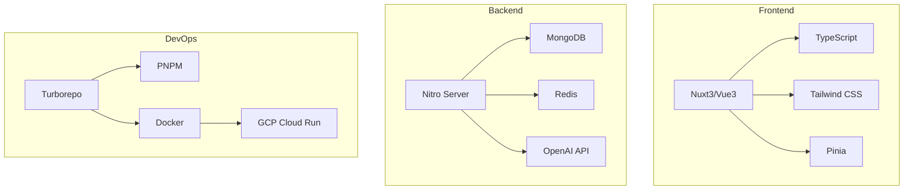

# SmartSurvey Pro - 技術棧與套件完整指南

> 📅 文件版本：v1.0  
> 📝 最後更新：2025-01-10  
> 🎯 用途：開發技術參考手冊  
> 👥 適用：開發團隊

---

## 🏗️ 核心技術架構



---

## 📦 套件總覽與用途

### 🔧 開發環境與構建工具

| 套件名稱           | 版本    | 用途                    | 安裝位置   |
| ------------------ | ------- | ----------------------- | ---------- |
| **pnpm**           | 8.15.0+ | 包管理器，節省磁碟空間  | 全局       |
| **turborepo**      | latest  | Monorepo 管理，並行構建 | 根目錄     |
| **typescript**     | ^5.3.0  | 類型系統                | 根目錄     |
| **vite**           | ^5.0.0  | 構建工具（Admin用）     | apps/admin |
| **@nuxt/devtools** | latest  | Nuxt 開發工具           | apps/web   |

### 🎨 前端框架與UI

| 套件名稱                 | 版本    | 用途     | 安裝命令                           |
| ------------------------ | ------- | -------- | ---------------------------------- |
| **nuxt**                 | ^3.9.0  | 全棧框架 | `pnpm add nuxt`                    |
| **vue**                  | ^3.4.0  | 前端框架 | 自動安裝                           |
| **@nuxtjs/tailwindcss**  | ^6.10.0 | CSS 框架 | `pnpm add -D @nuxtjs/tailwindcss`  |
| **@nuxtjs/google-fonts** | ^3.0.0  | 字體管理 | `pnpm add -D @nuxtjs/google-fonts` |
| **@nuxt/image**          | ^1.0.0  | 圖片優化 | `pnpm add @nuxt/image`             |
| **nuxt-icon**            | ^0.6.0  | 圖標系統 | `pnpm add nuxt-icon`               |

### 🗄️ 狀態管理與數據流

| 套件名稱                        | 版本    | 用途         | 安裝命令                               |
| ------------------------------- | ------- | ------------ | -------------------------------------- |
| **@pinia/nuxt**                 | ^0.5.0  | 狀態管理     | `pnpm add @pinia/nuxt`                 |
| **pinia**                       | ^2.1.0  | 狀態管理核心 | 自動安裝                               |
| **pinia-plugin-persistedstate** | ^3.2.0  | 狀態持久化   | `pnpm add pinia-plugin-persistedstate` |
| **@vueuse/nuxt**                | ^10.7.0 | 組合式工具庫 | `pnpm add @vueuse/nuxt`                |
| **@vueuse/core**                | ^10.7.0 | VueUse 核心  | 自動安裝                               |

### 🎯 拖拽與交互

| 套件名稱                   | 版本    | 用途            | 安裝命令                          |
| -------------------------- | ------- | --------------- | --------------------------------- |
| **@vueuse/gesture**        | ^2.0.0  | 手勢識別        | `pnpm add @vueuse/gesture`        |
| **vue-draggable-plus**     | ^0.3.0  | 拖拽功能        | `pnpm add vue-draggable-plus`     |
| **@interactjs/interactjs** | ^1.10.0 | 複雜交互        | `pnpm add @interactjs/interactjs` |
| **floating-vue**           | ^2.0.0  | 提示框/下拉選單 | `pnpm add floating-vue`           |

### 📊 數據可視化

| 套件名稱            | 版本    | 用途                   | 安裝命令                   |
| ------------------- | ------- | ---------------------- | -------------------------- |
| **chart.js**        | ^4.4.0  | 圖表庫                 | `pnpm add chart.js`        |
| **vue-chartjs**     | ^5.3.0  | Vue 圖表組件           | `pnpm add vue-chartjs`     |
| **apexcharts**      | ^3.45.0 | 進階圖表（選用）       | `pnpm add apexcharts`      |
| **vue3-apexcharts** | ^1.4.0  | ApexCharts Vue 封裝    | `pnpm add vue3-apexcharts` |
| **d3**              | ^7.8.0  | 複雜視覺化（Phase 3+） | `pnpm add d3`              |

### 🔐 認證與授權

| 套件名稱                | 版本   | 用途                 | 安裝命令                       |
| ----------------------- | ------ | -------------------- | ------------------------------ |
| **@sidebase/nuxt-auth** | ^0.6.0 | 認證模組             | `pnpm add @sidebase/nuxt-auth` |
| **next-auth**           | 4.21.0 | 認證核心             | 自動安裝                       |
| **jsonwebtoken**        | ^9.0.0 | JWT 處理             | `pnpm add jsonwebtoken`        |
| **bcryptjs**            | ^2.4.0 | 密碼加密             | `pnpm add bcryptjs`            |
| **jose**                | ^5.2.0 | JWT 驗證（Edge兼容） | `pnpm add jose`                |

### 🗃️ 資料庫與ORM

| 套件名稱           | 版本   | 用途                 | 安裝命令                  |
| ------------------ | ------ | -------------------- | ------------------------- |
| **mongodb**        | ^6.3.0 | MongoDB 驅動         | `pnpm add mongodb`        |
| **mongoose**       | ^8.0.0 | MongoDB ORM（選用）  | `pnpm add mongoose`       |
| **redis**          | ^4.6.0 | Redis 客戶端         | `pnpm add redis`          |
| **ioredis**        | ^5.3.0 | Redis 客戶端（進階） | `pnpm add ioredis`        |
| **@prisma/client** | ^5.8.0 | Prisma ORM（選用）   | `pnpm add @prisma/client` |

### ✅ 數據驗證

| 套件名稱    | 版本    | 用途                | 安裝命令           |
| ----------- | ------- | ------------------- | ------------------ |
| **zod**     | ^3.22.0 | Schema 驗證         | `pnpm add zod`     |
| **valibot** | ^0.25.0 | 輕量驗證（選用）    | `pnpm add valibot` |
| **yup**     | ^1.3.0  | Schema 驗證（選用） | `pnpm add yup`     |

### 📝 表單處理

| 套件名稱                  | 版本    | 用途             | 安裝命令                         |
| ------------------------- | ------- | ---------------- | -------------------------------- |
| **@vuelidate/core**       | ^2.0.0  | 表單驗證         | `pnpm add @vuelidate/core`       |
| **@vuelidate/validators** | ^2.0.0  | 驗證規則         | `pnpm add @vuelidate/validators` |
| **vee-validate**          | ^4.12.0 | 表單驗證（選用） | `pnpm add vee-validate`          |
| **@formkit/vue**          | ^1.5.0  | 表單框架（選用） | `pnpm add @formkit/vue`          |

### 🌐 API 與網路請求

| 套件名稱                | 版本    | 用途                   | 安裝命令                       |
| ----------------------- | ------- | ---------------------- | ------------------------------ |
| **ofetch**              | ^1.3.0  | Nuxt 內建請求庫        | 內建                           |
| **axios**               | ^1.6.0  | HTTP 客戶端（選用）    | `pnpm add axios`               |
| **@tanstack/vue-query** | ^5.17.0 | 數據獲取（選用）       | `pnpm add @tanstack/vue-query` |
| **graphql-request**     | ^6.1.0  | GraphQL 客戶端（選用） | `pnpm add graphql-request`     |

### 🔄 實時通訊

| 套件名稱             | 版本    | 用途                 | 安裝命令                    |
| -------------------- | ------- | -------------------- | --------------------------- |
| **socket.io-client** | ^4.6.0  | WebSocket 客戶端     | `pnpm add socket.io-client` |
| **socket.io**        | ^4.6.0  | WebSocket 服務端     | `pnpm add socket.io`        |
| **@y-js/yjs**        | ^13.6.0 | CRDT 協作（Phase 2） | `pnpm add yjs`              |
| **y-websocket**      | ^1.5.0  | Yjs WebSocket        | `pnpm add y-websocket`      |

### 🤖 AI 整合

| 套件名稱      | 版本    | 用途                  | 安裝命令             |
| ------------- | ------- | --------------------- | -------------------- |
| **openai**    | ^4.24.0 | OpenAI SDK            | `pnpm add openai`    |
| **langchain** | ^0.1.0  | AI 鏈式調用（選用）   | `pnpm add langchain` |
| **ai**        | ^3.0.0  | Vercel AI SDK（選用） | `pnpm add ai`        |

### 🎨 UI 組件庫（選用）

| 套件名稱            | 版本    | 用途       | 安裝命令                   |
| ------------------- | ------- | ---------- | -------------------------- |
| **@headlessui/vue** | ^1.7.0  | 無樣式組件 | `pnpm add @headlessui/vue` |
| **radix-vue**       | ^1.3.0  | 無樣式組件 | `pnpm add radix-vue`       |
| **primevue**        | ^3.46.0 | 完整 UI 庫 | `pnpm add primevue`        |
| **naive-ui**        | ^2.36.0 | 完整 UI 庫 | `pnpm add naive-ui`        |
| **shadcn-vue**      | latest  | 組件集合   | 手動複製                   |

### 🧪 測試工具

| 套件名稱             | 版本    | 用途          | 安裝命令                       |
| -------------------- | ------- | ------------- | ------------------------------ |
| **vitest**           | ^1.2.0  | 單元測試      | `pnpm add -D vitest`           |
| **@vue/test-utils**  | ^2.4.0  | Vue 組件測試  | `pnpm add -D @vue/test-utils`  |
| **@nuxt/test-utils** | ^3.9.0  | Nuxt 測試工具 | `pnpm add -D @nuxt/test-utils` |
| **playwright**       | ^1.41.0 | E2E 測試      | `pnpm add -D playwright`       |
| **@faker-js/faker**  | ^8.3.0  | 測試數據生成  | `pnpm add -D @faker-js/faker`  |

### 📋 開發工具

| 套件名稱            | 版本    | 用途         | 安裝命令                      |
| ------------------- | ------- | ------------ | ----------------------------- |
| **eslint**          | ^8.56.0 | 代碼檢查     | `pnpm add -D eslint`          |
| **prettier**        | ^3.2.0  | 代碼格式化   | `pnpm add -D prettier`        |
| **husky**           | ^8.0.0  | Git hooks    | `pnpm add -D husky`           |
| **lint-staged**     | ^15.2.0 | 暫存區檢查   | `pnpm add -D lint-staged`     |
| **commitizen**      | ^4.3.0  | 提交規範     | `pnpm add -D commitizen`      |
| **@commitlint/cli** | ^18.4.0 | 提交訊息檢查 | `pnpm add -D @commitlint/cli` |

### 🔧 工具函數庫

| 套件名稱      | 版本    | 用途          | 安裝命令             |
| ------------- | ------- | ------------- | -------------------- |
| **lodash-es** | ^4.17.0 | 工具函數      | `pnpm add lodash-es` |
| **date-fns**  | ^3.2.0  | 日期處理      | `pnpm add date-fns`  |
| **dayjs**     | ^1.11.0 | 輕量日期庫    | `pnpm add dayjs`     |
| **nanoid**    | ^5.0.0  | ID 生成       | `pnpm add nanoid`    |
| **uuid**      | ^9.0.0  | UUID 生成     | `pnpm add uuid`      |
| **slugify**   | ^1.6.0  | URL slug 生成 | `pnpm add slugify`   |

### 📤 檔案處理

| 套件名稱       | 版本    | 用途       | 安裝命令              |
| -------------- | ------- | ---------- | --------------------- |
| **file-saver** | ^2.0.0  | 檔案下載   | `pnpm add file-saver` |
| **xlsx**       | ^0.18.0 | Excel 處理 | `pnpm add xlsx`       |
| **papaparse**  | ^5.4.0  | CSV 處理   | `pnpm add papaparse`  |
| **pdfmake**    | ^0.2.0  | PDF 生成   | `pnpm add pdfmake`    |
| **sharp**      | ^0.33.0 | 圖片處理   | `pnpm add sharp`      |

### 🌍 國際化（Phase 3+）

| 套件名稱         | 版本   | 用途       | 安裝命令                |
| ---------------- | ------ | ---------- | ----------------------- |
| **@nuxtjs/i18n** | ^8.0.0 | 國際化模組 | `pnpm add @nuxtjs/i18n` |
| **vue-i18n**     | ^9.8.0 | Vue 國際化 | 自動安裝                |

### 🚀 部署與監控

| 套件名稱              | 版本    | 用途        | 安裝命令                     |
| --------------------- | ------- | ----------- | ---------------------------- |
| **@sentry/vue**       | ^7.91.0 | 錯誤監控    | `pnpm add @sentry/vue`       |
| **@sentry/nuxt**      | ^7.91.0 | Nuxt Sentry | `pnpm add @sentry/nuxt`      |
| **@vercel/analytics** | ^1.1.0  | 分析工具    | `pnpm add @vercel/analytics` |
| **web-vitals**        | ^3.5.0  | 性能監控    | `pnpm add web-vitals`        |

---

## 🔨 安裝指南

### 1. 環境準備

```bash
# 安裝 Node.js (>= 18.0.0)
# 建議使用 nvm 管理 Node 版本
curl -o- https://raw.githubusercontent.com/nvm-sh/nvm/v0.39.0/install.sh | bash
nvm install 18
nvm use 18

# 安裝 pnpm
npm install -g pnpm@8

# 驗證安裝
node --version  # v18.x.x
pnpm --version  # 8.x.x
```

### 2. 初始化 Monorepo

```bash
# 創建專案目錄
mkdir survey-builder
cd survey-builder

# 初始化 pnpm workspace
pnpm init

# 創建 workspace 配置
cat > pnpm-workspace.yaml << EOF
packages:
  - 'apps/*'
  - 'packages/*'
EOF

# 安裝 Turborepo
pnpm add -D turbo
```

### 3. Phase 1 核心套件安裝

```bash
# 在根目錄安裝開發工具
pnpm add -D \
  typescript@^5.3.0 \
  eslint@^8.56.0 \
  prettier@^3.2.0 \
  husky@^8.0.0 \
  lint-staged@^15.2.0 \
  @types/node@^20.0.0

# 創建 Nuxt 應用
mkdir -p apps/web
cd apps/web
pnpm dlx nuxi@latest init . --force

# 安裝 Nuxt 模組
pnpm add -D \
  @nuxtjs/tailwindcss \
  @nuxtjs/google-fonts

pnpm add \
  @pinia/nuxt \
  @vueuse/nuxt \
  nuxt-icon \
  mongodb \
  redis \
  zod \
  jsonwebtoken \
  bcryptjs

# 創建共享包
cd ../..
mkdir -p packages/shared/src
cd packages/shared
pnpm init
pnpm add zod
```

### 4. 配置 TypeScript

```bash
# 根目錄 tsconfig.json
cat > tsconfig.json << 'EOF'
{
  "compilerOptions": {
    "target": "ES2022",
    "module": "ESNext",
    "lib": ["ES2022", "DOM"],
    "moduleResolution": "bundler",
    "strict": true,
    "esModuleInterop": true,
    "skipLibCheck": true,
    "forceConsistentCasingInFileNames": true,
    "paths": {
      "@survey/shared": ["./packages/shared/src"],
      "@survey/shared/*": ["./packages/shared/src/*"]
    }
  }
}
EOF
```

### 5. 配置 Turbo

```bash
# turbo.json
cat > turbo.json << 'EOF'
{
  "$schema": "https://turbo.build/schema.json",
  "pipeline": {
    "build": {
      "dependsOn": ["^build"],
      "outputs": [".nuxt/**", ".output/**", "dist/**"]
    },
    "dev": {
      "cache": false,
      "persistent": true
    },
    "lint": {},
    "type-check": {}
  }
}
EOF
```

---

## 📦 套件使用範例

### 拖拽功能實現

```typescript
// composables/useDragDrop.ts
import { useDraggable, useDroppable } from '@vueuse/gesture';
import interact from '@interactjs/interactjs';

export function useDragDrop() {
  const initDraggable = (element: HTMLElement) => {
    interact(element).draggable({
      inertia: true,
      modifiers: [
        interact.modifiers.restrictRect({
          restriction: 'parent',
          endOnly: true,
        }),
      ],
      autoScroll: true,
      listeners: {
        move: dragMoveListener,
      },
    });
  };

  return { initDraggable };
}
```

### 狀態管理配置

```typescript
// stores/survey.ts
import { defineStore } from 'pinia';
import { nanoid } from 'nanoid';
import type { Survey } from '@survey/shared/types';

export const useSurveyStore = defineStore('survey', () => {
  const surveys = ref<Survey[]>([]);

  const createSurvey = (data: Partial<Survey>) => {
    const newSurvey: Survey = {
      id: nanoid(),
      ...data,
      createdAt: new Date(),
    };
    surveys.value.push(newSurvey);
    return newSurvey;
  };

  return {
    surveys: readonly(surveys),
    createSurvey,
  };
});
```

### 資料驗證

```typescript
// schemas/survey.schema.ts
import { z } from 'zod';

export const SurveySchema = z.object({
  title: z.string().min(1).max(200),
  description: z.string().max(1000).optional(),
  questions: z.array(QuestionSchema).min(1),
  theme: ThemeSchema,
  status: z.enum(['draft', 'published', 'archived']),
});

export type Survey = z.infer<typeof SurveySchema>;
```

### API 請求封裝

```typescript
// composables/useApi.ts
import { $fetch } from 'ofetch';

export function useApi() {
  const config = useRuntimeConfig();

  const api = $fetch.create({
    baseURL: config.public.apiBase,
    onRequest({ options }) {
      const token = useCookie('auth-token');
      if (token.value) {
        options.headers = {
          ...options.headers,
          Authorization: `Bearer ${token.value}`,
        };
      }
    },
  });

  return { api };
}
```

---

## 🚀 各階段套件安裝計劃

### Phase 1-2 (MVP)

```bash
# 必要套件
pnpm add nuxt @pinia/nuxt @vueuse/nuxt
pnpm add mongodb redis zod
pnpm add jsonwebtoken bcryptjs
pnpm add chart.js vue-chartjs
pnpm add -D @nuxtjs/tailwindcss
```

### Phase 3-4 (核心功能)

```bash
# AI 和協作
pnpm add openai
pnpm add socket.io socket.io-client
pnpm add yjs y-websocket
pnpm add vue-draggable-plus
```

### Phase 5-6 (企業功能)

```bash
# 進階功能
pnpm add @sidebase/nuxt-auth
pnpm add ioredis
pnpm add @nuxtjs/i18n
pnpm add @sentry/nuxt

# Admin 前端 (Nuxt3 初期)
cd apps/admin
pnpm add nuxt @pinia/nuxt
```

### Phase 7-8 (擴展優化)

```bash
# 前端性能和監控
pnpm add @vercel/analytics
pnpm add web-vitals
pnpm add sharp
pnpm add pdfmake xlsx

# Admin 遷移到 Vite
cd apps/admin
pnpm add vite @vitejs/plugin-vue
pnpm add vue vue-router pinia
pnpm add axios echarts

# Go 後端初始化
cd services/admin-api
go mod init github.com/survey-builder/admin-api
go get github.com/gin-gonic/gin
go get go.mongodb.org/mongo-driver
go get github.com/redis/go-redis/v9
go get github.com/golang-jwt/jwt/v5
go get golang.org/x/crypto
```

---

## 💡 最佳實踐建議

### 1. 套件選擇原則

- ✅ 優先選擇 Vue3/Nuxt3 生態系統內的套件
- ✅ 選擇有良好維護和文檔的套件
- ✅ 考慮套件大小對打包體積的影響
- ✅ 避免功能重複的套件

### 2. 版本管理

- 使用 `^` 允許小版本更新
- 關鍵套件使用固定版本
- 定期更新依賴（每月一次）
- 使用 `pnpm update --interactive` 選擇性更新

### 3. 性能考慮

- 使用動態導入減少初始載入
- Tree-shaking 移除未使用代碼
- 按需載入大型套件（如 Chart.js）

### 4. 安全性

- 定期運行 `pnpm audit`
- 及時更新有安全漏洞的套件
- 使用 `.npmrc` 配置私有 registry

---

## 🔍 疑難排解

### 常見問題

#### 1. pnpm 安裝失敗

```bash
# 清理快取
pnpm store prune

# 重新安裝
rm -rf node_modules pnpm-lock.yaml
pnpm install
```

#### 2. TypeScript 路徑解析問題

```json
// 在 nuxt.config.ts 添加
{
  "alias": {
    "@survey/shared": "../../packages/shared/src"
  },
  "build": {
    "transpile": ["@survey/shared"]
  }
}
```

#### 3. Turbo 快取問題

```bash
# 清理 Turbo 快取
pnpm turbo run build --force
```

---

## 📚 學習資源

### 官方文檔

- [PNPM 文檔](https://pnpm.io/zh/)
- [Turborepo 文檔](https://turbo.build/repo/docs)
- [Nuxt 3 文檔](https://nuxt.com/)
- [Vue 3 文檔](https://cn.vuejs.org/)
- [Pinia 文檔](https://pinia.vuejs.org/zh/)

### 教程推薦

- [Nuxt 3 從入門到實戰](https://www.youtube.com/watch?v=...)
- [Monorepo 最佳實踐](https://monorepo.tools/)
- [TypeScript 進階指南](https://www.typescriptlang.org/docs/handbook/)

### 社群資源

- [Vue.js 台灣](https://www.facebook.com/groups/vuejs.tw/)
- [Nuxt Discord](https://discord.com/invite/nuxt)
- [Stack Overflow](https://stackoverflow.com/questions/tagged/nuxt3)

---

## 🎯 快速開始檢查清單

- [ ] Node.js >= 18.0.0 已安裝
- [ ] pnpm 8.x 已安裝
- [ ] Git 已配置
- [ ] VS Code 或其他編輯器已準備
- [ ] MongoDB 本地或雲端已準備
- [ ] Redis 本地或雲端已準備
- [ ] OpenAI API Key 已取得（Phase 2）

---

_本文檔將持續更新，記錄專案使用的所有技術和套件_
