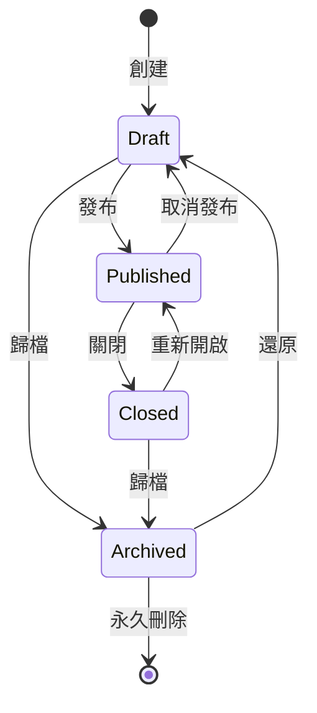

# SmartSurvey Pro - Business Logic Documentation 🧮

> 業務邏輯規則與計算公式詳細說明  
> 最後更新：2025-01-10  
> 版本：v1.0

---

## 📋 目錄

- [訂閱方案與限制](#訂閱方案與限制)
- [問卷狀態機](#問卷狀態機)
- [權限管理矩陣](#權限管理矩陣)
- [問卷邏輯規則](#問卷邏輯規則)
- [資料驗證規則](#資料驗證規則)
- [統計計算公式](#統計計算公式)
- [計分系統](#計分系統)
- [資料品質檢測](#資料品質檢測)
- [自動化規則](#自動化規則)
- [業務限制規則](#業務限制規則)

---

## 💎 訂閱方案與限制

### 方案對照表

| 功能 | Free | Pro | Team | Enterprise |
|------|------|-----|------|------------|
| **問卷數量** | 3 | 無限 | 無限 | 無限 |
| **每月回應數** | 100 | 10,000 | 50,000 | 無限 |
| **每份問卷回應上限** | 100 | 5,000 | 10,000 | 無限 |
| **問題數/問卷** | 10 | 100 | 無限 | 無限 |
| **團隊成員** | 1 | 1 | 10 | 無限 |
| **檔案上傳空間** | 10MB | 1GB | 10GB | 100GB |
| **AI 額度/月** | 0 | 100 | 500 | 5000 |
| **資料保留期** | 3個月 | 1年 | 2年 | 永久 |
| **API 存取** | ❌ | ✅ | ✅ | ✅ |
| **自訂網域** | ❌ | ❌ | ✅ | ✅ |
| **價格/月** | $0 | $29 | $99 | 客製 |

### 限制檢查邏輯

```typescript
// 檢查是否可創建新問卷
function canCreateSurvey(user: User): boolean {
  const plan = user.subscription.plan
  const currentCount = user.subscription.usage.surveys
  
  if (plan === 'free' && currentCount >= 3) {
    throw new Error('LIMIT_EXCEEDED: 免費方案最多 3 份問卷')
  }
  
  return true
}

// 檢查是否可接收回應
function canAcceptResponse(survey: Survey, user: User): boolean {
  const plan = user.subscription.plan
  const monthlyResponses = user.subscription.usage.responses
  const surveyResponses = survey.stats.completions
  
  // 月度限制
  const monthlyLimits = {
    free: 100,
    pro: 10000,
    team: 50000,
    enterprise: Infinity
  }
  
  if (monthlyResponses >= monthlyLimits[plan]) {
    throw new Error('MONTHLY_LIMIT_EXCEEDED')
  }
  
  // 單份問卷限制
  const surveyLimits = {
    free: 100,
    pro: 5000,
    team: 10000,
    enterprise: Infinity
  }
  
  if (surveyResponses >= surveyLimits[plan]) {
    throw new Error('SURVEY_LIMIT_EXCEEDED')
  }
  
  return true
}

// AI 額度檢查
function checkAICredits(user: User, operation: string): boolean {
  const costs = {
    generateSurvey: 10,
    optimizeQuestion: 2,
    analyzeResponses: 5,
    generateInsights: 8
  }
  
  const remaining = user.subscription.limits.aiCredits - 
                   user.subscription.usage.aiCreditsUsed
  
  if (remaining < costs[operation]) {
    throw new Error('AI_CREDITS_INSUFFICIENT')
  }
  
  return true
}
```

### 升級觸發點

```typescript
// 自動提示升級的條件
const upgradeTriggers = {
  free_to_pro: {
    surveys: 3,           // 達到上限
    responses: 80,        // 80% 使用率
    message: '您已使用 80% 的免費額度，升級 Pro 享受無限問卷！'
  },
  
  pro_to_team: {
    collaborators: 2,     // 需要協作
    responses: 8000,      // 80% 使用率
    message: '看起來您的團隊正在成長，升級團隊方案享受更多功能！'
  }
}
```

---

## 🔄 問卷狀態機

### 狀態定義

```typescript
enum SurveyStatus {
  DRAFT = 'draft',           // 草稿
  PUBLISHED = 'published',   // 已發布
  CLOSED = 'closed',        // 已關閉
  ARCHIVED = 'archived'     // 已歸檔
}
```

### 狀態轉換規則



### 狀態轉換條件

```typescript
const stateTransitions = {
  draft: {
    canTransitionTo: ['published', 'archived'],
    conditions: {
      published: {
        minQuestions: 1,
        allQuestionsValid: true,
        hasTitle: true
      },
      archived: {
        // 無條件限制
      }
    }
  },
  
  published: {
    canTransitionTo: ['closed', 'draft'],
    conditions: {
      closed: {
        // 無條件限制
      },
      draft: {
        noActiveResponses: true,  // 沒有進行中的回應
        confirmAction: true        // 需要確認
      }
    }
  },
  
  closed: {
    canTransitionTo: ['published', 'archived'],
    conditions: {
      published: {
        withinEndDate: true,       // 未超過結束日期
        hasRemainingQuota: true    // 還有回應額度
      },
      archived: {
        after30Days: true          // 關閉 30 天後才能歸檔
      }
    }
  },
  
  archived: {
    canTransitionTo: ['draft'],
    conditions: {
      draft: {
        withinRetentionPeriod: true,  // 在保留期內
        hasStorageSpace: true         // 有儲存空間
      }
    }
  }
}
```

---

## 🔐 權限管理矩陣

### 個人權限

```typescript
const personalPermissions = {
  survey: {
    create: ['free', 'pro', 'team', 'enterprise'],
    read_own: ['free', 'pro', 'team', 'enterprise'],
    update_own: ['free', 'pro', 'team', 'enterprise'],
    delete_own: ['free', 'pro', 'team', 'enterprise'],
    publish_own: ['free', 'pro', 'team', 'enterprise'],
    export_own: ['pro', 'team', 'enterprise']  // Pro 以上
  },
  
  response: {
    view_own: ['free', 'pro', 'team', 'enterprise'],
    export_own: ['pro', 'team', 'enterprise'],
    delete_own: ['pro', 'team', 'enterprise']
  },
  
  analytics: {
    basic: ['free', 'pro', 'team', 'enterprise'],
    advanced: ['pro', 'team', 'enterprise'],
    ai_insights: ['pro', 'team', 'enterprise']
  }
}
```

### 團隊權限 (Phase 3+)

```typescript
enum TeamRole {
  OWNER = 'owner',      // 擁有者
  ADMIN = 'admin',      // 管理員  
  EDITOR = 'editor',    // 編輯者
  VIEWER = 'viewer'     // 檢視者
}

const teamPermissions = {
  owner: {
    survey: ['create', 'read', 'update', 'delete', 'publish'],
    response: ['read', 'export', 'delete'],
    team: ['invite', 'remove', 'update_role', 'delete_team'],
    billing: ['view', 'update']
  },
  
  admin: {
    survey: ['create', 'read', 'update', 'delete', 'publish'],
    response: ['read', 'export', 'delete'],
    team: ['invite', 'remove', 'update_role'],
    billing: ['view']
  },
  
  editor: {
    survey: ['create', 'read', 'update', 'publish'],
    response: ['read', 'export'],
    team: [],
    billing: []
  },
  
  viewer: {
    survey: ['read'],
    response: ['read'],
    team: [],
    billing: []
  }
}

// 權限檢查函數
function hasPermission(
  user: User,
  resource: string,
  action: string,
  resourceOwner?: string
): boolean {
  // 檢查是否為資源擁有者
  if (resourceOwner === user.id) {
    return personalPermissions[resource]?.[`${action}_own`]
      ?.includes(user.subscription.plan)
  }
  
  // 檢查團隊權限
  const userTeamRole = getUserTeamRole(user, resourceOwner)
  if (userTeamRole) {
    return teamPermissions[userTeamRole][resource]?.includes(action)
  }
  
  return false
}
```

---

## 🔀 問卷邏輯規則

### 邏輯跳轉類型

```typescript
enum LogicType {
  SKIP_TO = 'skip_to',           // 跳至特定題目
  SHOW_HIDE = 'show_hide',        // 顯示/隱藏題目
  END_SURVEY = 'end_survey',      // 結束問卷
  REDIRECT = 'redirect',          // 重定向到外部連結
  CALCULATE = 'calculate'         // 計算分數
}
```

### 條件運算子

```typescript
enum ConditionOperator {
  // 通用
  EQUALS = 'equals',                    // 等於
  NOT_EQUALS = 'not_equals',            // 不等於
  CONTAINS = 'contains',                // 包含
  NOT_CONTAINS = 'not_contains',        // 不包含
  
  // 數值
  GREATER_THAN = 'greater_than',        // 大於
  LESS_THAN = 'less_than',              // 小於
  BETWEEN = 'between',                  // 介於
  
  // 選擇題
  ANY_OF = 'any_of',                    // 任一
  ALL_OF = 'all_of',                    // 全部
  NONE_OF = 'none_of',                  // 都不是
  
  // 狀態
  IS_ANSWERED = 'is_answered',          // 已回答
  IS_NOT_ANSWERED = 'is_not_answered'   // 未回答
}
```

### 邏輯執行引擎

```typescript
class LogicEngine {
  // 評估條件
  evaluateCondition(
    condition: LogicCondition,
    answers: Map<string, any>
  ): boolean {
    const answer = answers.get(condition.questionId)
    
    switch (condition.operator) {
      case 'equals':
        return answer === condition.value
        
      case 'contains':
        return String(answer).includes(condition.value)
        
      case 'greater_than':
        return Number(answer) > Number(condition.value)
        
      case 'between':
        const [min, max] = condition.value
        return answer >= min && answer <= max
        
      case 'any_of':
        return condition.value.some(v => 
          Array.isArray(answer) ? answer.includes(v) : answer === v
        )
        
      case 'is_answered':
        return answer !== undefined && answer !== null && answer !== ''
        
      default:
        return false
    }
  }
  
  // 執行邏輯動作
  executeLogic(
    logic: LogicRule,
    answers: Map<string, any>
  ): LogicAction {
    // 評估所有條件
    const conditionsMet = logic.conditions.every(condition =>
      this.evaluateCondition(condition, answers)
    )
    
    if (!conditionsMet) return null
    
    // 執行動作
    switch (logic.action) {
      case 'skip_to':
        return {
          type: 'navigate',
          target: logic.targetQuestionId
        }
        
      case 'show_hide':
        return {
          type: 'visibility',
          questionIds: logic.questionIds,
          visible: logic.show
        }
        
      case 'end_survey':
        return {
          type: 'end',
          message: logic.endMessage
        }
        
      case 'calculate':
        return {
          type: 'score',
          formula: logic.formula,
          result: this.calculate(logic.formula, answers)
        }
    }
  }
}
```

### 邏輯驗證規則

```typescript
const logicValidationRules = {
  // 避免無限循環
  noCircularReferences: (logic: LogicRule[]): boolean => {
    const graph = buildDependencyGraph(logic)
    return !hasCircularDependency(graph)
  },
  
  // 確保目標存在
  validTargets: (logic: LogicRule, survey: Survey): boolean => {
    if (logic.action === 'skip_to') {
      return survey.questions.some(q => q.id === logic.targetQuestionId)
    }
    return true
  },
  
  // 條件題目必須在邏輯題目之前
  questionOrder: (logic: LogicRule, survey: Survey): boolean => {
    const conditionIndex = survey.questions.findIndex(
      q => q.id === logic.conditions[0].questionId
    )
    const targetIndex = survey.questions.findIndex(
      q => q.id === logic.targetQuestionId
    )
    return conditionIndex < targetIndex
  }
}
```

---

## ✅ 資料驗證規則

### 題型驗證規則

```typescript
const validationRules = {
  // 文字題
  text_short: {
    minLength: 1,
    maxLength: 500,
    pattern: null,
    required: true,
    sanitize: (value: string) => value.trim()
  },
  
  text_long: {
    minLength: 1,
    maxLength: 5000,
    pattern: null,
    required: true,
    sanitize: (value: string) => value.trim()
  },
  
  // Email
  email: {
    pattern: /^[^\s@]+@[^\s@]+\.[^\s@]+$/,
    maxLength: 254,
    normalize: (value: string) => value.toLowerCase().trim(),
    checkDuplicate: true  // 檢查重複提交
  },
  
  // 電話
  phone: {
    pattern: /^[\d\s\-\+\(\)]+$/,
    minLength: 10,
    maxLength: 20,
    normalize: (value: string) => value.replace(/\D/g, '')
  },
  
  // 數字
  number: {
    min: -999999999,
    max: 999999999,
    precision: 2,
    allowNegative: true,
    validate: (value: number, rules: any) => {
      if (rules.min !== undefined && value < rules.min) {
        return `數值不能小於 ${rules.min}`
      }
      if (rules.max !== undefined && value > rules.max) {
        return `數值不能大於 ${rules.max}`
      }
      return true
    }
  },
  
  // 日期
  date: {
    format: 'YYYY-MM-DD',
    minDate: '1900-01-01',
    maxDate: '2100-12-31',
    validate: (value: string, rules: any) => {
      const date = new Date(value)
      const now = new Date()
      
      if (rules.disablePast && date < now) {
        return '不能選擇過去的日期'
      }
      if (rules.disableFuture && date > now) {
        return '不能選擇未來的日期'
      }
      
      return true
    }
  },
  
  // 選擇題
  single_choice: {
    validate: (value: string, question: Question) => {
      const validOptions = question.options.map(o => o.value)
      
      if (!validOptions.includes(value)) {
        return '請選擇有效的選項'
      }
      
      return true
    }
  },
  
  multiple_choice: {
    minSelections: 1,
    maxSelections: null,
    validate: (values: string[], question: Question, rules: any) => {
      const validOptions = question.options.map(o => o.value)
      
      // 檢查所有選項是否有效
      if (!values.every(v => validOptions.includes(v))) {
        return '包含無效的選項'
      }
      
      // 檢查數量限制
      if (rules.minSelections && values.length < rules.minSelections) {
        return `至少選擇 ${rules.minSelections} 個選項`
      }
      if (rules.maxSelections && values.length > rules.maxSelections) {
        return `最多選擇 ${rules.maxSelections} 個選項`
      }
      
      return true
    }
  },
  
  // 評分題
  rating: {
    min: 1,
    max: 10,
    validate: (value: number, rules: any) => {
      if (value < rules.min || value > rules.max) {
        return `請選擇 ${rules.min} 到 ${rules.max} 之間的分數`
      }
      return true
    }
  },
  
  // 檔案上傳
  file_upload: {
    maxSize: 10 * 1024 * 1024,  // 10MB
    allowedTypes: ['pdf', 'doc', 'docx', 'jpg', 'jpeg', 'png'],
    validate: (file: File, rules: any) => {
      // 檢查檔案大小
      if (file.size > rules.maxSize) {
        return `檔案大小不能超過 ${rules.maxSize / 1024 / 1024}MB`
      }
      
      // 檢查檔案類型
      const extension = file.name.split('.').pop()?.toLowerCase()
      if (!rules.allowedTypes.includes(extension)) {
        return `只允許上傳 ${rules.allowedTypes.join(', ')} 格式`
      }
      
      return true
    }
  }
}
```

### 跨欄位驗證

```typescript
// 關聯欄位驗證
const crossFieldValidation = {
  // 日期範圍驗證
  dateRange: (startDate: string, endDate: string): boolean => {
    return new Date(startDate) <= new Date(endDate)
  },
  
  // 數值總和驗證
  sumValidation: (values: number[], target: number): boolean => {
    const sum = values.reduce((a, b) => a + b, 0)
    return sum === target
  },
  
  // 百分比驗證
  percentageValidation: (values: number[]): boolean => {
    const sum = values.reduce((a, b) => a + b, 0)
    return sum === 100
  },
  
  // 排序題驗證
  rankingValidation: (rankings: number[], itemCount: number): boolean => {
    // 檢查是否包含 1 到 N 的所有數字
    const expected = Array.from({length: itemCount}, (_, i) => i + 1)
    return expected.every(n => rankings.includes(n))
  }
}
```

---

## 📊 統計計算公式

### 基礎統計

```typescript
class StatisticsCalculator {
  // 完成率
  calculateCompletionRate(survey: Survey): number {
    if (survey.stats.starts === 0) return 0
    return (survey.stats.completions / survey.stats.starts) * 100
  }
  
  // 放棄率
  calculateAbandonmentRate(survey: Survey): number {
    if (survey.stats.starts === 0) return 0
    const abandons = survey.stats.starts - survey.stats.completions
    return (abandons / survey.stats.starts) * 100
  }
  
  // 平均完成時間
  calculateAvgCompletionTime(responses: Response[]): number {
    const completedResponses = responses.filter(r => r.status === 'completed')
    if (completedResponses.length === 0) return 0
    
    const totalTime = completedResponses.reduce(
      (sum, r) => sum + r.totalTime, 0
    )
    return totalTime / completedResponses.length
  }
  
  // 題目跳過率
  calculateSkipRate(questionId: string, responses: Response[]): number {
    const totalResponses = responses.length
    if (totalResponses === 0) return 0
    
    const skipped = responses.filter(r => 
      r.answers.find(a => a.questionId === questionId)?.skipped
    ).length
    
    return (skipped / totalResponses) * 100
  }
}
```

### 進階分析

```typescript
class AdvancedAnalytics {
  // NPS 分數計算
  calculateNPS(ratings: number[]): number {
    const total = ratings.length
    if (total === 0) return 0
    
    const promoters = ratings.filter(r => r >= 9).length
    const detractors = ratings.filter(r => r <= 6).length
    
    return ((promoters - detractors) / total) * 100
  }
  
  // 滿意度分數 (CSAT)
  calculateCSAT(ratings: number[], threshold: number = 4): number {
    const total = ratings.length
    if (total === 0) return 0
    
    const satisfied = ratings.filter(r => r >= threshold).length
    return (satisfied / total) * 100
  }
  
  // 標準差
  calculateStandardDeviation(values: number[]): number {
    const n = values.length
    if (n === 0) return 0
    
    const mean = values.reduce((a, b) => a + b, 0) / n
    const variance = values.reduce((sum, val) => 
      sum + Math.pow(val - mean, 2), 0
    ) / n
    
    return Math.sqrt(variance)
  }
  
  // 相關性分析
  calculateCorrelation(x: number[], y: number[]): number {
    const n = x.length
    if (n !== y.length || n === 0) return 0
    
    const sumX = x.reduce((a, b) => a + b, 0)
    const sumY = y.reduce((a, b) => a + b, 0)
    const sumXY = x.reduce((sum, xi, i) => sum + xi * y[i], 0)
    const sumX2 = x.reduce((sum, xi) => sum + xi * xi, 0)
    const sumY2 = y.reduce((sum, yi) => sum + yi * yi, 0)
    
    const numerator = n * sumXY - sumX * sumY
    const denominator = Math.sqrt(
      (n * sumX2 - sumX * sumX) * (n * sumY2 - sumY * sumY)
    )
    
    return denominator === 0 ? 0 : numerator / denominator
  }
}
```

### 趨勢分析

```typescript
class TrendAnalysis {
  // 移動平均
  movingAverage(data: number[], period: number): number[] {
    const result: number[] = []
    
    for (let i = period - 1; i < data.length; i++) {
      const sum = data.slice(i - period + 1, i + 1)
        .reduce((a, b) => a + b, 0)
      result.push(sum / period)
    }
    
    return result
  }
  
  // 成長率
  growthRate(current: number, previous: number): number {
    if (previous === 0) return current > 0 ? 100 : 0
    return ((current - previous) / previous) * 100
  }
  
  // 預測（簡單線性回歸）
  forecast(data: number[], periods: number): number[] {
    const n = data.length
    const x = Array.from({length: n}, (_, i) => i)
    const y = data
    
    // 計算斜率和截距
    const sumX = x.reduce((a, b) => a + b, 0)
    const sumY = y.reduce((a, b) => a + b, 0)
    const sumXY = x.reduce((sum, xi, i) => sum + xi * y[i], 0)
    const sumX2 = x.reduce((sum, xi) => sum + xi * xi, 0)
    
    const slope = (n * sumXY - sumX * sumY) / (n * sumX2 - sumX * sumX)
    const intercept = (sumY - slope * sumX) / n
    
    // 預測未來值
    const predictions: number[] = []
    for (let i = 0; i < periods; i++) {
      predictions.push(slope * (n + i) + intercept)
    }
    
    return predictions
  }
}
```

---

## 🎯 計分系統

### 計分類型

```typescript
enum ScoringType {
  SIMPLE = 'simple',           // 簡單加總
  WEIGHTED = 'weighted',       // 加權計分
  CATEGORY = 'category',       // 分類計分
  CUSTOM = 'custom'           // 自定義公式
}
```

### 計分規則

```typescript
class ScoringEngine {
  // 簡單計分
  simpleScore(answers: Answer[], scoreMap: Map<string, number>): number {
    return answers.reduce((total, answer) => {
      const score = scoreMap.get(answer.value) || 0
      return total + score
    }, 0)
  }
  
  // 加權計分
  weightedScore(
    answers: Answer[],
    weights: Map<string, number>
  ): number {
    return answers.reduce((total, answer) => {
      const weight = weights.get(answer.questionId) || 1
      const score = this.getAnswerScore(answer)
      return total + (score * weight)
    }, 0)
  }
  
  // 分類計分
  categoryScore(answers: Answer[]): Record<string, number> {
    const categories: Record<string, number> = {}
    
    answers.forEach(answer => {
      const category = this.getQuestionCategory(answer.questionId)
      if (!categories[category]) {
        categories[category] = 0
      }
      categories[category] += this.getAnswerScore(answer)
    })
    
    return categories
  }
  
  // 百分位計算
  calculatePercentile(score: number, allScores: number[]): number {
    const sorted = allScores.sort((a, b) => a - b)
    const index = sorted.findIndex(s => s >= score)
    return (index / sorted.length) * 100
  }
  
  // 等級判定
  getGrade(score: number, maxScore: number): string {
    const percentage = (score / maxScore) * 100
    
    if (percentage >= 90) return 'A'
    if (percentage >= 80) return 'B'
    if (percentage >= 70) return 'C'
    if (percentage >= 60) return 'D'
    return 'F'
  }
}
```

### 評分標準

```typescript
const scoringCriteria = {
  // 李克特量表
  likertScale: {
    '非常不同意': 1,
    '不同意': 2,
    '中立': 3,
    '同意': 4,
    '非常同意': 5
  },
  
  // 反向計分
  reverseScoring: (score: number, max: number): number => {
    return max - score + 1
  },
  
  // 區間計分
  rangeScoring: (value: number): number => {
    if (value < 25) return 1
    if (value < 50) return 2
    if (value < 75) return 3
    return 4
  },
  
  // 自定義公式
  customFormula: (answers: Answer[]): number => {
    // 範例：(Q1 * 2 + Q2 * 3 + Q3) / 6 * 100
    const q1 = Number(answers[0]?.value) || 0
    const q2 = Number(answers[1]?.value) || 0
    const q3 = Number(answers[2]?.value) || 0
    
    return ((q1 * 2 + q2 * 3 + q3) / 6) * 100
  }
}
```

---

## 🔍 資料品質檢測

### 品質指標

```typescript
class QualityDetector {
  // 極速作答檢測
  detectSpeeding(response: Response): boolean {
    const avgTimePerQuestion = response.totalTime / response.answers.length
    const MINIMUM_TIME = 2  // 每題至少 2 秒
    
    return avgTimePerQuestion < MINIMUM_TIME
  }
  
  // 直線作答檢測（所有選擇題選同一選項）
  detectStraightLining(answers: Answer[]): boolean {
    const choiceAnswers = answers.filter(a => 
      ['single_choice', 'rating', 'scale'].includes(a.questionType)
    )
    
    if (choiceAnswers.length < 5) return false
    
    const firstValue = choiceAnswers[0].value
    const allSame = choiceAnswers.every(a => a.value === firstValue)
    
    return allSame
  }
  
  // 模式作答檢測（如 ABAB 模式）
  detectPatternAnswering(answers: Answer[]): boolean {
    const values = answers.map(a => a.value)
    
    // 檢測重複模式
    for (let patternLength = 2; patternLength <= 4; patternLength++) {
      const pattern = values.slice(0, patternLength)
      let isPattern = true
      
      for (let i = patternLength; i < values.length; i++) {
        if (values[i] !== pattern[i % patternLength]) {
          isPattern = false
          break
        }
      }
      
      if (isPattern) return true
    }
    
    return false
  }
  
  // 無意義文字檢測
  detectGibberish(text: string): boolean {
    // 檢查是否包含大量重複字元
    const repeatedChars = /(.)\1{4,}/  // 同一字元重複 5 次以上
    if (repeatedChars.test(text)) return true
    
    // 檢查是否為隨機字元
    const consonantRatio = this.getConsonantRatio(text)
    if (consonantRatio > 0.8) return true  // 子音比例過高
    
    // 檢查是否包含常見測試文字
    const testPatterns = ['test', 'asdf', 'qwer', '1234', 'aaaa']
    return testPatterns.some(pattern => 
      text.toLowerCase().includes(pattern)
    )
  }
  
  // 重複提交檢測
  detectDuplicate(response: Response, previousResponses: Response[]): boolean {
    // IP + User Agent 相同
    const sameDevice = previousResponses.some(r =>
      r.respondent.ipHash === response.respondent.ipHash &&
      r.respondent.userAgent === response.respondent.userAgent &&
      r.submittedAt > new Date(Date.now() - 24 * 60 * 60 * 1000)  // 24小時內
    )
    
    if (sameDevice) return true
    
    // 答案相似度過高
    const similarity = this.calculateSimilarity(response, previousResponses)
    return similarity > 0.95  // 95% 相似
  }
  
  // 計算品質分數
  calculateQualityScore(response: Response): number {
    let score = 100
    const penalties = {
      speeding: 30,
      straightLining: 25,
      pattern: 20,
      gibberish: 25,
      incomplete: 15
    }
    
    if (this.detectSpeeding(response)) score -= penalties.speeding
    if (this.detectStraightLining(response.answers)) score -= penalties.straightLining
    if (this.detectPatternAnswering(response.answers)) score -= penalties.pattern
    
    // 檢查文字回答
    const textAnswers = response.answers.filter(a => 
      a.questionType.includes('text')
    )
    if (textAnswers.some(a => this.detectGibberish(a.value))) {
      score -= penalties.gibberish
    }
    
    // 檢查完成度
    const completionRate = response.answers.filter(a => !a.skipped).length 
      / response.answers.length
    if (completionRate < 0.8) score -= penalties.incomplete
    
    return Math.max(0, score)
  }
}
```

---

## ⚙️ 自動化規則

### 自動儲存

```typescript
const autoSaveRules = {
  // 觸發條件
  triggers: {
    timeInterval: 30,           // 每 30 秒
    questionCompleted: true,     // 完成一題後
    pageChange: true,           // 換頁時
    windowBlur: true            // 視窗失焦時
  },
  
  // 儲存策略
  strategy: {
    maxRetries: 3,
    retryDelay: 1000,           // 1 秒後重試
    conflictResolution: 'latest', // 衝突時使用最新版本
    compression: true            // 壓縮資料
  }
}
```

### 自動關閉

```typescript
const autoCloseRules = {
  // 依日期
  byDate: (survey: Survey): boolean => {
    if (!survey.settings.endDate) return false
    return new Date() > new Date(survey.settings.endDate)
  },
  
  // 依回應數
  byResponseCount: (survey: Survey): boolean => {
    if (!survey.settings.responseLimit) return false
    return survey.stats.completions >= survey.settings.responseLimit
  },
  
  // 每日限額
  byDailyLimit: (survey: Survey, todayResponses: number): boolean => {
    if (!survey.settings.dailyResponseLimit) return false
    return todayResponses >= survey.settings.dailyResponseLimit
  }
}
```

### 通知規則

```typescript
const notificationRules = {
  // 即時通知
  realtime: {
    firstResponse: true,         // 第一個回應
    milestoneResponses: [10, 50, 100, 500, 1000],  // 里程碑
    dailyReport: '09:00',       // 每日報告時間
    weeklyReport: 'monday'      // 週報告
  },
  
  // Email 通知
  email: {
    responseThreshold: 10,       // 每 10 個回應
    completionRate: 0.9,        // 完成率達 90%
    abnormalActivity: true,      // 異常活動
    quotaWarning: 0.8           // 額度使用 80%
  },
  
  // 通知內容模板
  templates: {
    firstResponse: {
      subject: '🎉 您的問卷收到第一個回應！',
      body: '恭喜！「{surveyTitle}」已經收到第一個回應。'
    },
    milestone: {
      subject: '📊 問卷達到 {count} 個回應',
      body: '您的問卷「{surveyTitle}」已經收集到 {count} 個回應！'
    },
    quotaWarning: {
      subject: '⚠️ 回應額度即將用完',
      body: '您本月的回應額度已使用 {percentage}%，請考慮升級方案。'
    }
  }
}
```

---

## 📏 業務限制規則

### 檔案上傳限制

```typescript
const fileUploadLimits = {
  // 依訂閱方案
  maxFileSize: {
    free: 1 * 1024 * 1024,      // 1MB
    pro: 10 * 1024 * 1024,      // 10MB
    team: 50 * 1024 * 1024,     // 50MB
    enterprise: 100 * 1024 * 1024  // 100MB
  },
  
  // 總儲存空間
  totalStorage: {
    free: 10 * 1024 * 1024,     // 10MB
    pro: 1024 * 1024 * 1024,    // 1GB
    team: 10 * 1024 * 1024 * 1024,  // 10GB
    enterprise: 100 * 1024 * 1024 * 1024  // 100GB
  },
  
  // 允許的檔案類型
  allowedTypes: {
    documents: ['pdf', 'doc', 'docx', 'txt'],
    images: ['jpg', 'jpeg', 'png', 'gif', 'webp'],
    spreadsheets: ['xls', 'xlsx', 'csv'],
    videos: ['mp4', 'webm'],  // Enterprise only
  },
  
  // 防病毒掃描
  virusScan: true,
  
  // 檔案保留期限
  retention: {
    free: 90,                    // 90 天
    pro: 365,                    // 1 年
    team: 730,                   // 2 年
    enterprise: null             // 永久
  }
}
```

### API 限流規則

```typescript
const rateLimits = {
  // 端點限制
  endpoints: {
    '/auth/login': {
      window: 900,               // 15 分鐘
      max: 5                     // 最多 5 次
    },
    '/auth/register': {
      window: 3600,              // 1 小時
      max: 3                     // 最多 3 次
    },
    '/surveys': {
      window: 60,                // 1 分鐘
      max: {
        free: 10,
        pro: 60,
        team: 120,
        enterprise: 600
      }
    },
    '/responses': {
      window: 60,
      max: {
        free: 20,
        pro: 100,
        team: 200,
        enterprise: 1000
      }
    }
  },
  
  // 全域限制
  global: {
    window: 60,
    max: {
      anonymous: 60,
      free: 300,
      pro: 1000,
      team: 2000,
      enterprise: 10000
    }
  },
  
  // 爆量處理
  burst: {
    enabled: true,
    multiplier: 1.5,             // 允許 1.5 倍爆量
    duration: 10                 // 10 秒內
  }
}
```

### 併發限制

```typescript
const concurrencyLimits = {
  // 同時編輯
  simultaneousEditors: {
    free: 1,
    pro: 1,
    team: 5,
    enterprise: 20
  },
  
  // 即時連線
  realtimeConnections: {
    free: 0,                     // 不支援
    pro: 10,
    team: 50,
    enterprise: 500
  },
  
  // 匯出任務
  exportJobs: {
    free: 1,
    pro: 3,
    team: 5,
    enterprise: 20
  },
  
  // API 併發請求
  apiConcurrency: {
    free: 2,
    pro: 10,
    team: 20,
    enterprise: 100
  }
}
```

---

## 🔐 安全規則

### 密碼政策

```typescript
const passwordPolicy = {
  minLength: 8,
  maxLength: 128,
  requireUppercase: true,
  requireLowercase: true,
  requireNumbers: true,
  requireSpecialChars: false,    // 選擇性
  
  // 密碼強度計算
  calculateStrength: (password: string): number => {
    let strength = 0
    
    if (password.length >= 12) strength += 20
    if (/[a-z]/.test(password)) strength += 20
    if (/[A-Z]/.test(password)) strength += 20
    if (/[0-9]/.test(password)) strength += 20
    if (/[^a-zA-Z0-9]/.test(password)) strength += 20
    
    return strength
  },
  
  // 常見密碼黑名單
  blacklist: [
    'password', '12345678', 'qwerty', 'abc123',
    'password123', 'admin', 'letmein'
  ],
  
  // 密碼歷史
  preventReuse: 5,               // 不能使用最近 5 個密碼
  
  // 密碼過期
  expirationDays: {
    free: null,                  // 不過期
    pro: null,
    team: 90,                    // 90 天
    enterprise: 60               // 60 天
  }
}
```

### Session 管理

```typescript
const sessionRules = {
  // Session 有效期
  duration: {
    default: 24 * 60 * 60,       // 24 小時
    remember: 7 * 24 * 60 * 60,  // 7 天
    admin: 2 * 60 * 60           // 2 小時
  },
  
  // 閒置超時
  idleTimeout: {
    default: 30 * 60,            // 30 分鐘
    admin: 15 * 60               // 15 分鐘
  },
  
  // 併發 Session
  maxConcurrentSessions: {
    free: 1,
    pro: 3,
    team: 5,
    enterprise: 10
  },
  
  // Session 固定防護
  regenerateOnLogin: true,
  regenerateOnPrivilegeChange: true
}
```

---

## 📋 總結

這份業務邏輯文件涵蓋了 SmartSurvey Pro 的所有核心業務規則，包括：

1. **訂閱限制**：明確各方案的功能差異
2. **狀態管理**：問卷生命週期控制
3. **權限控制**：細粒度的存取控制
4. **邏輯引擎**：複雜的條件判斷與跳轉
5. **驗證規則**：完整的資料驗證
6. **統計公式**：標準化的計算方法
7. **品質控制**：自動化的資料品質檢測
8. **自動化**：減少人工操作
9. **安全政策**：保護系統與資料

這些規則應該在程式碼中實作為獨立的模組，便於維護和測試。

---

*最後更新：2025-01-10*  
*此文件會隨業務需求持續更新*